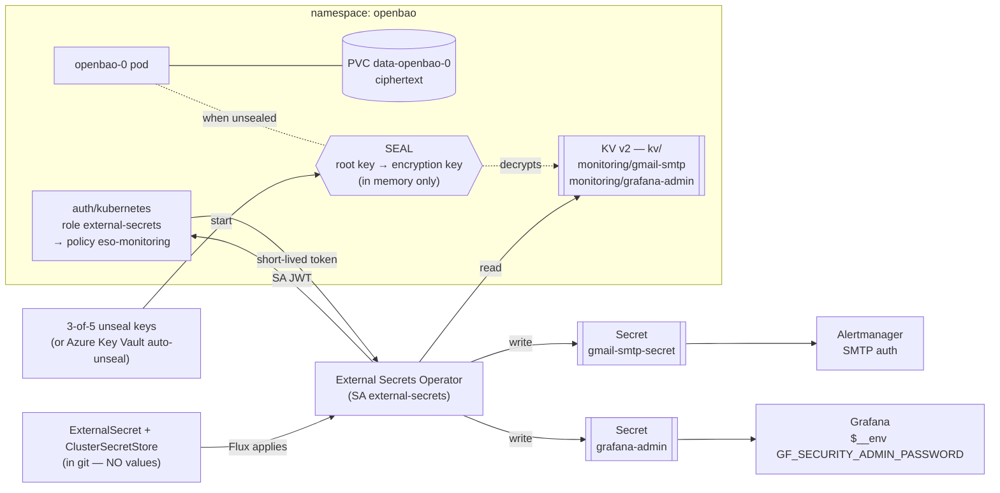

# AKS GitOps — Grafana dashboards + Prometheus alerting, operator + CRD driven

A reference setup for running application observability on AKS the **GitOps + Kubernetes
operator** way:

- an **nginx** demo app deployed to two namespaces (`dev`, `qa`) by **Flux + Kustomize**
- **Prometheus** (kube-prometheus-stack) scraping it
- **Grafana** run *in the cluster*, its dashboards/datasource/folders managed as
  **`Grafana*` custom resources** by the **Grafana Operator** — no clicking in the UI
- **alerting** as **`PrometheusRule` + `AlertmanagerConfig` custom resources** → email
- a **permanent public URL** for Grafana via an Azure DNS label

Everything is declared in this git repo. Nothing is `kubectl apply`-ed by hand; nothing is
configured in a UI. No Azure-native monitoring is used — this runs its **own** Prometheus
and Grafana. (The Azure portal's *Monitoring → Dashboards with Grafana* is a *different*,
Azure-managed Grafana; our dashboards do not appear there.)

| Deep dive | |
|---|---|
| Apps overview (nginx-demo + user-login) | [`apps/README.md`](apps/README.md) |
| user-login app (React + Node + Postgres, migrations, reset) | [`apps/user-login/README.md`](apps/user-login/README.md) |
| Prometheus backend | [`infrastructure/prometheus/README.md`](infrastructure/prometheus/README.md) |
| Grafana + how to add dashboards + the URL/PVC | [`infrastructure/grafana/README.md`](infrastructure/grafana/README.md) |
| Alerting + how to add rules | [`infrastructure/alert/README.md`](infrastructure/alert/README.md) |
| Secret management (ESO + OpenBao) | [`infrastructure/secrets/README.md`](infrastructure/secrets/README.md) |
| CloudNativePG operator | [`infrastructure/cnpg/README.md`](infrastructure/cnpg/README.md) |
| **Build from scratch (shareable runbook)** | [§3](#3-build-this-from-scratch--step-by-step) |
| DNS / permanent URL | [§4](#4-dns--the-permanent-url) |
| Secrets (OpenBao: seal/unseal, auto-unseal) · Hardening | [§5](#5-secrets--security) |
| **Tear down to save cost / stand back up** | [§11](#11-tear-down-to-save-cost--and-stand-back-up) |

---

## Quick reference (this deployment)

| | |
|---|---|
| Cluster | `san-dev-aks` / RG `san-rg` / sub `bf286ce3-6142-41dc-9c9b-fd993989df20` / `eastus2` |
| Repo | `https://github.com/sandeshlamsal/Devops_Aks_Gitops_Grafana_Alert` branch `main` |
| Flux config | `nginx-demo-config` (AKS Flux extension, namespace `flux-system`) |
| **Grafana** | **http://nginx-demo-grafana.eastus2.cloudapp.azure.com** — `admin` / password from OpenBao (`kv/monitoring/grafana-admin`); **Nginx Dashboard** in folder **Custom Application Dashboards** |
| **user-login UI** | **http://userdir-dev.eastus2.cloudapp.azure.com** · **http://userdir-qa.eastus2.cloudapp.azure.com** — log in `admin` / `password123`, then see the user list |
| App namespaces | nginx-demo: `nginx-dev-app-ns` (2), `nginx-qa-app-ns` (1) · user-login: `userlogin-dev-ns`, `userlogin-qa-ns` |
| Platform namespaces | `monitoring` (Prometheus/Alertmanager/Grafana + operators), `external-secrets` (ESO), `openbao`, `cnpg-system` |
| Secrets | values only in OpenBao — `kv/monitoring/{gmail-smtp,grafana-admin}`, `kv/userlogin/jwt`; Postgres creds generated by CNPG |
| Alert | `NginxPodRestarting` → email `parasisandesh@hotmail.com` (Gmail SMTP) |

---

## 1. How it fits together

```
 GitHub repo (main) ─► Flux (source-controller pulls; kustomize-controller applies;
                              helm-controller installs charts)
        │
        ├─ Kustomization: prometheus        → HelmRelease kube-prometheus-stack
        │      installs Prometheus + Prometheus Operator + Alertmanager
        │
        ├─ Kustomization: grafana-operator  → HelmRelease grafana-operator   (dependsOn prometheus)
        │      installs the Grafana Operator + its CRDs
        │
        ├─ Kustomization: grafana           → Grafana / GrafanaDatasource / GrafanaFolder /
        │      (dependsOn grafana-operator)   GrafanaDashboard CRs
        │      operator builds a Grafana Deployment + LoadBalancer Service (:80, Azure DNS
        │      label) and pushes the datasource + "Nginx Dashboard" into it via its HTTP API
        │
        ├─ Kustomization: alert             → PrometheusRule + AlertmanagerConfig CRs
        │      (dependsOn prometheus, secrets)  Prometheus Operator merges them in
        │
        ├─ Kustomization: external-secrets-operator → HelmRelease external-secrets (+ CRDs)
        ├─ Kustomization: openbao           → HelmRelease openbao  (OSS Vault fork)
        ├─ Kustomization: secrets           → ClusterSecretStore + ExternalSecret CRs
        │      (dependsOn external-secrets-operator, openbao, prometheus)
        │      ESO reads OpenBao → writes Secrets gmail-smtp-secret + grafana-admin
        │
        ├─ Kustomization: apps    → apps/nginx-demo/overlays/dev  → nginx-dev-app-ns
        └─ Kustomization: apps-qa → apps/nginx-demo/overlays/qa   → nginx-qa-app-ns
             each overlay ships a ServiceMonitor; Prometheus auto-discovers it

 nginx-demo pod ─/metrics─► Prometheus ─datasource─► Grafana dashboards
                                │ evaluates PrometheusRule
                                ▼
                           Alertmanager ◄─ AlertmanagerConfig (route + email receiver)
                                │ NginxPodRestarting fires
                                ▼
                     email via Gmail SMTP ─► recipient
                     (SMTP password: OpenBao → ESO → Secret gmail-smtp-secret)
```

**The operator idea, in one paragraph.** A Helm chart installs a *controller* that watches
*custom resources*. You write a small YAML object (`GrafanaDashboard`, `PrometheusRule`,
…); the controller reconciles it into the running system (pushes the dashboard, rewrites
Prometheus config). Flux delivers those YAML objects from git. So "add a dashboard" or
"add an alert" = commit a file — no imperative steps, and the cluster self-heals to match
git.

---

## 2. Repository layout

```
apps/
  README.md                   apps overview + the base/overlay pattern
  nginx-demo/                  nginx + exporter sidecar
    overlays/dev|qa/           → nginx-dev-app-ns (2), nginx-qa-app-ns (1)
  user-login/                  3 microservices: React UI + Node API + Postgres
    api/                       Node/Express source + migrations/*.sql + Dockerfile
    ui/                        React (Vite) source + nginx.conf + Dockerfile
    k8s/base/                  CNPG Cluster, api, ui, migrate Job, suspended reset CronJob, ExternalSecret
    k8s/overlays/dev|qa/       → userlogin-dev-ns, userlogin-qa-ns
    README.md

infrastructure/
  prometheus/                 kube-prometheus-stack Helm install + the monitoring namespace
  secrets/                    External Secrets Operator + OpenBao — no secret values in git
    operator/                 ESO Helm install — its OWN Flux Kustomization
    openbao/                  OpenBao (OSS Vault fork) Helm install — its OWN Flux Kustomization
    stores/                   ClusterSecretStore → OpenBao
    externalsecrets/          ExternalSecret CRs → gmail-smtp-secret, grafana-admin
  cnpg/                        CloudNativePG operator Helm install — its OWN Flux Kustomization
  grafana/
    operator/                 the Grafana Operator Helm install — its OWN Flux Kustomization
    grafana.yaml              Grafana instance CR (LoadBalancer :80 + Azure DNS label + PVC)
                              + GrafanaDatasource CR (→ Prometheus, uid prometheusdatasource)
    folder.yaml               GrafanaFolder "Custom Application Dashboards"
    dashboard.yaml            GrafanaDashboard CR → the ConfigMap key, filed in the folder
    json/nginx-demo.json      the dashboard model (plain Grafana JSON, has a Namespace picker)
    kustomization.yaml        configMapGenerator bundles json/*.json into a ConfigMap
  alert/
    alertmanager-config.yaml  AlertmanagerConfig — routing + Gmail email receiver
    rules/nginx-restarts.yaml PrometheusRule — NginxPodRestarting

clusters/dev/                 human-readable copies of the Flux Kustomizations (see §3.5)
docker/                       Dockerfile for nginx-demo (static site, stub_status enabled)
```

Each `apps/*` and `infrastructure/*` folder has its own README.

---

## 3. Build this from scratch — step by step

> Shareable runbook: from an empty AKS cluster to working dashboards + alerts + a URL.
> Replace `san-rg`, `san-dev-aks`, the subscription id, the repo URL, the DNS label and
> the email addresses with your own.

### 3.0 Prerequisites

- an AKS cluster and `kubectl` context for it
- `az` CLI logged in; `kubectl`; optionally the `flux` CLI (nicer status output)
- an ACR (or any registry) the cluster can pull from
- a Gmail account with 2-Step Verification + an **app password** (for alert email)

```bash
az account set --subscription <SUBSCRIPTION_ID>
az aks get-credentials -g <RG> -n <CLUSTER>
```

### 3.1 Build & push the app images

Cloud-build straight into ACR (no local Docker needed):

```bash
az acr build --registry <ACR_NAME> --image nginx-demo:v1     ./docker
az acr build --registry <ACR_NAME> --image user-login-api:v1 ./apps/user-login/api
az acr build --registry <ACR_NAME> --image user-login-ui:v1  ./apps/user-login/ui
az aks update -g <RG> -n <CLUSTER> --attach-acr <ACR_NAME>
```

If your registry name isn't `sanaksregistry`, update the image paths in
`apps/nginx-demo/base/deployment.yaml` and the `images:` blocks in
`apps/user-login/k8s/overlays/{dev,qa}/kustomization.yaml`. The nginx image bakes in
`docker/default.conf` with `stub_status` enabled (the exporter sidecar needs it).

### 3.2 Secrets — nothing is created by hand

Secret **values** never touch the repo. **External Secrets Operator** + **OpenBao** (see
`infrastructure/secrets/`) sync them into Kubernetes Secrets the apps consume:
`gmail-smtp-secret` (Alertmanager), `grafana-admin` (Grafana), `userlogin-jwt`
(user-login API). Postgres credentials are generated by CloudNativePG, not OpenBao.

The only manual step is a **one-time OpenBao bootstrap** (init → unseal → enable KV +
Kubernetes auth → policy → seed the values), done *after* Flux installs OpenBao in §3.7
— full command block in [`infrastructure/secrets/README.md`](infrastructure/secrets/README.md#bootstrap-openbao-one-time--first-install-or-after-any-tier--2-rebuild).
The policy must read both prefixes, and you seed three values:

```bash
bao policy write eso-monitoring - <<'EOF'
path "kv/data/monitoring/*" { capabilities = ["read"] }
path "kv/data/userlogin/*"  { capabilities = ["read"] }
EOF
bao kv put kv/monitoring/gmail-smtp    password='YOUR_GMAIL_APP_PASSWORD'
bao kv put kv/monitoring/grafana-admin password='A_STRONG_ADMIN_PASSWORD'
bao kv put kv/userlogin/jwt            secret="$(openssl rand -hex 32)"
```

Update `to:` / `from:` / `authUsername:` in `infrastructure/alert/alertmanager-config.yaml`
to your addresses.

### 3.3 Pick a DNS label for Grafana

Edit `infrastructure/grafana/grafana.yaml`:

- `spec.service.metadata.annotations["service.beta.kubernetes.io/azure-dns-label-name"]`
  → a name unique in your region, e.g. `myteam-grafana`
- `spec.config.server.domain` and `root_url` → `myteam-grafana.<region>.cloudapp.azure.com`

Azure will publish `myteam-grafana.<region>.cloudapp.azure.com` and pin it to the
LoadBalancer's public IP. (See §4 for the full DNS story and the HTTPS upgrade.)

### 3.4 Point this repo at your fork/branch

Push this tree to your own git repo. Note the URL + branch for the next step.

### 3.5 Install the Flux extension + configuration on AKS

```bash
az provider register --namespace Microsoft.KubernetesConfiguration

az k8s-extension create \
  -g <RG> -c <CLUSTER> -t managedClusters \
  --name flux --extension-type microsoft.flux

az k8s-configuration flux create \
  -g <RG> -c <CLUSTER> -t managedClusters \
  --name nginx-demo-config --namespace flux-system \
  --url <YOUR_REPO_URL> --branch main \
  --kustomization name=apps                     path=./apps/nginx-demo/overlays/dev   prune=true \
  --kustomization name=apps-qa                  path=./apps/nginx-demo/overlays/qa    prune=true \
  --kustomization name=prometheus               path=./infrastructure/prometheus      prune=true \
  --kustomization name=external-secrets-operator path=./infrastructure/secrets/operator prune=true \
  --kustomization name=openbao                  path=./infrastructure/secrets/openbao prune=true \
  --kustomization name=secrets                  path=./infrastructure/secrets         prune=true dependsOn=["external-secrets-operator","openbao","prometheus"] \
  --kustomization name=grafana-operator         path=./infrastructure/grafana/operator prune=true dependsOn=["prometheus"] \
  --kustomization name=grafana                  path=./infrastructure/grafana         prune=true dependsOn=["grafana-operator","secrets"] \
  --kustomization name=alert                    path=./infrastructure/alert           prune=true dependsOn=["prometheus","secrets"] \
  --kustomization name=cnpg-operator            path=./infrastructure/cnpg            prune=true \
  --kustomization name=user-login-dev           path=./apps/user-login/k8s/overlays/dev prune=true dependsOn=["cnpg-operator","secrets"] \
  --kustomization name=user-login-qa            path=./apps/user-login/k8s/overlays/qa  prune=true dependsOn=["cnpg-operator","secrets"]
```

**Ordering matters and is expressed with `dependsOn`:**
`prometheus` → `grafana-operator` → `grafana`; `external-secrets-operator` + `openbao` →
`secrets` → `grafana` + `alert`; `cnpg-operator` → `user-login-{dev,qa}` (also on
`secrets`). Anything that *installs* CRDs (`*-operator`, `openbao`) is its own
Kustomization — Flux refuses to apply a Kustomization containing a CR whose CRD is not
registered yet.

### 3.6 One-time RBAC for the new namespaces

The AKS Flux extension impersonates a `flux-applier` ServiceAccount **in the namespace
each resource lands in**, but only provisions that SA for namespaces it knows about
(here: just `flux-system`, because no `--kustomization` sets `targetNamespace`). Our
HelmReleases and app resources declare their own `metadata.namespace`, so each target
namespace needs the SA too, or helm-/kustomize-controller fails with
`serviceaccount "flux-applier" ... cannot list resource "secrets"`.

**Run this *before* §3.5** (create the namespaces + SAs + bindings first) so the first
reconcile has no failure window:

```bash
for ns in monitoring openbao external-secrets cnpg-system \
          nginx-dev-app-ns nginx-qa-app-ns userlogin-dev-ns userlogin-qa-ns; do
  kubectl create namespace "$ns" --dry-run=client -o yaml | kubectl apply -f -
  kubectl create serviceaccount flux-applier -n "$ns" --dry-run=client -o yaml | kubectl apply -f -
  kubectl create clusterrolebinding "flux-applier-$ns" --clusterrole=cluster-admin \
    --serviceaccount="$ns:flux-applier" --dry-run=client -o yaml | kubectl apply -f -
done
```

(Alternative: recreate the config passing `targetNamespace=<ns>` on every
`--kustomization` so the extension provisions the SAs itself.)

### 3.7 Wait, then bootstrap OpenBao

```bash
kubectl get kustomization -n flux-system -w        # names are prefixed nginx-demo-config-*
kubectl get helmrelease -A                         # kube-prom-stack, grafana-operator, external-secrets, openbao
kubectl get pods -n openbao                        # openbao-0 Running but 0/1 → it starts SEALED
```

**`openbao` / `secrets` (and thus `grafana`, `alert`) stay not-ready until you bootstrap
OpenBao once** — init, unseal, enable KV + Kubernetes auth, seed the two values. Full
command block:
[`infrastructure/secrets/README.md` → Bootstrap OpenBao](infrastructure/secrets/README.md#bootstrap-openbao-one-time-after-first-install--after-any-tier--2-rebuild).

Then it converges:

```bash
kubectl get externalsecret -n monitoring          # gmail-smtp-secret, grafana-admin → SecretSynced=True
kubectl get kustomization -n flux-system          # all → READY=True, same revision
kubectl get pods -n monitoring                     # prometheus-*, alertmanager-*, grafana-*, *-operator-*
kubectl get pods -n nginx-dev-app-ns               # nginx-demo 2/2 x2
kubectl get pods -n nginx-qa-app-ns                # nginx-demo 2/2 x1
```

First reconcile can take a few minutes (Helm installs, image pulls, CRD registration).
`grafana` may briefly show `dry-run failed: no matches for kind "GrafanaDashboard"` until
`grafana-operator` finishes — it self-resolves.

> The `clusters/dev/*.yaml` files mirror the Kustomizations above for readers. They are
> **not** applied by the AKS extension (which is driven by the `az` command). The very
> first cluster named the Prometheus Kustomization `infrastructure`; the command above
> names it `prometheus` — match `clusters/dev/` and the deep-dive READMEs.

### 3.8 Get the Grafana URL

```bash
kubectl get svc grafana-service -n monitoring \
  -o jsonpath='{.status.loadBalancer.ingress[0].ip}'         # public IP
# hostname (from your DNS label):
#   http://<label>.<region>.cloudapp.azure.com
```

Open it → login `admin` / `changeme123` → **Dashboards → Custom Application Dashboards →
Nginx Dashboard** → use the **Namespace** picker.

### 3.9 Smoke-test the alert

```bash
kubectl exec -n nginx-dev-app-ns deploy/nginx-demo -c nginx-demo -- sh -c "kill 1"
```

Within ~2 minutes `NginxPodRestarting` goes pending → firing and an email is sent. Full
walkthrough in §6.

---

## 4. DNS & the permanent URL

`grafana-service` is a `type: LoadBalancer` Service. Two annotations/overrides in
`infrastructure/grafana/grafana.yaml` turn its bare IP into a stable URL:

```yaml
spec:
  service:
    metadata:
      annotations:
        service.beta.kubernetes.io/azure-dns-label-name: "nginx-demo-grafana"
    spec:
      type: LoadBalancer
      ports:
        - { name: grafana-http, port: 80, targetPort: 3000, protocol: TCP }   # no :3000 in the URL
```

- The Azure cloud-controller-manager creates a **managed Public IP** and attaches the
  DNS label → `nginx-demo-grafana.<region>.cloudapp.azure.com`.
- The hostname stays attached to that IP; if the Service is recreated Azure keeps the
  label with the config, so the **URL is stable to share**.
- `spec.config.server.domain` / `root_url` are set to the same hostname so Grafana builds
  correct redirect/share links.

Check it:

```bash
dig +short nginx-demo-grafana.eastus2.cloudapp.azure.com
curl -s http://nginx-demo-grafana.eastus2.cloudapp.azure.com/api/health
```

### Custom domain + HTTPS (recommended for real use)

Plain HTTP on a `cloudapp.azure.com` name is fine for a dev/demo. For production put it
behind TLS:

1. `kubectl` install **ingress-nginx** and **cert-manager** (Helm), or use AGIC.
2. Switch `grafana-service` back to `type: ClusterIP` (drop the DNS-label annotation).
3. Add an `Ingress` under `spec.ingress` of the `Grafana` CR with your hostname, an
   `ingressClassName`, and a cert-manager `cluster-issuer` annotation.
4. Point a CNAME from `grafana.yourcompany.com` at the ingress controller's LB.
5. Set `spec.config.server.root_url` to `https://grafana.yourcompany.com/`.

---

## 5. Secrets & security

### 5.1 Secret management with OpenBao + External Secrets Operator

**Why not plain Kubernetes Secrets?** They're base64 (not encryption), readable by anyone
who can `get secret`, live in etcd, and are one careless `kubectl apply -f` away from git.
This repo keeps **zero secret values in version control**.

**The two pieces**

| | |
|---|---|
| **OpenBao** (`infrastructure/secrets/openbao/`) | The vault. Stores secrets encrypted at rest, with access policies, an audit log, versioning and rotation. Open-source (MPL-2.0, Linux Foundation) — the fork of HashiCorp Vault; API-compatible with it. |
| **External Secrets Operator** (`infrastructure/secrets/operator/`) | The bridge. Reconciles `ExternalSecret` CRs: authenticates to OpenBao with its Kubernetes ServiceAccount, reads a path, and writes a normal `Secret` that apps consume. `refreshInterval` re-syncs, so rotating in OpenBao propagates automatically. |



Every secret in this system lives only in OpenBao. Add another with one `bao kv put` +
one `ExternalSecret` — worked examples in
[`infrastructure/secrets/README.md`](infrastructure/secrets/README.md#add-a-new-secret--worked-examples),
which also covers the ServiceAccounts, seal/unseal, and Azure Key Vault auto-unseal in
depth.

### 5.2 Seal / unseal — the core OpenBao concept

OpenBao encrypts all its data with an **encryption key**, and that key is itself
encrypted by the **root key** (a.k.a. master key). On disk everything is ciphertext.

When OpenBao starts it is **sealed**: it has the ciphertext but *not* the root key in
memory, so it can decrypt nothing and every API call returns `503`.

**Unsealing** reconstructs the root key in memory:

```
unseal key shares  ──(Shamir's Secret Sharing, 3-of-5)──►  root / master key
                                                                │ decrypts
                                                           encryption key
                                                                │ decrypts
                                                           your secrets (kv/…)
```

- `bao operator init` (once) generates the root key and splits it into **5 unseal key
  shares** with a **threshold of 3**. No single share reveals anything; any 3 reconstruct
  the root key. The shares + the initial root token are **printed once** — store the
  shares separately (different people / vaults). Lose 3 of 5 → data is unrecoverable.
- `bao operator unseal <share>` × 3 → OpenBao rebuilds the root key → decrypts the
  encryption key → **unsealed**, serving.
- A restart (pod reschedule, node reboot, `az aks stop`/`start`) **re-seals** — you unseal
  again. This is why manual unseal doesn't scale for 24×7 systems.

This repo uses **Shamir / manual unseal** because it needs nothing extra to provision.
The one-time bootstrap is in
[`infrastructure/secrets/README.md`](infrastructure/secrets/README.md#bootstrap-openbao-one-time-after-first-install--after-any-tier--2-rebuild).

### 5.3 Auto-unseal — how the master key is protected by a KMS

**Auto-unseal** removes humans from the startup path by delegating protection of the root
key to an external KMS — **Azure Key Vault** (or AWS/GCP KMS, or another OpenBao's
`transit` engine).

- At `init`, OpenBao generates the root key and immediately asks the KMS to **wrap**
  (encrypt) it; only the wrapped blob is written to disk. The plaintext root key is never
  persisted.
- On **every startup** OpenBao sends the wrapped blob to the KMS; the KMS **unwraps** it
  using a key that never leaves the KMS/HSM; OpenBao gets the root key back in memory →
  **auto-unsealed**, no shares, no humans.
- Shamir shares are replaced by **recovery keys** (still 3-of-5) — used only for
  break-glass operations (regenerate the root token, rekey), never for routine startup.
- Trust moves to the KMS: access is gated by Azure RBAC + a managed / workload identity,
  and the key can sit in a FIPS-140 HSM.

To switch this repo to Azure Key Vault auto-unseal, replace the `server.standalone.config`
HCL in `infrastructure/secrets/openbao/openbao.yaml` with:

```hcl
seal "azurekeyvault" {
  tenant_id  = "<AAD_TENANT_ID>"
  vault_name = "<KEYVAULT_NAME>"
  key_name   = "openbao-unseal"
  # credentials come from the pod's AKS workload identity — no client secret in config
}
storage "file" { path = "/openbao/data" }
listener "tcp" { address = "[::]:8200"; tls_disable = 1 }
```

plus: a Key Vault + an RSA/AES key named `openbao-unseal`; the `Key Vault Crypto User`
role for OpenBao's identity; AKS **workload identity** federated to OpenBao's
ServiceAccount. Then `bao operator init` prints **recovery** keys and the pod comes up
unsealed on its own — including after `az aks start`.

### 5.4 Hardening checklist

| Area | State in this repo | Go further |
|---|---|---|
| Secret management | **External Secrets Operator + OpenBao** (`infrastructure/secrets/`). No secret values in git; `gmail-smtp-secret` + `grafana-admin` are synced from OpenBao via `ExternalSecret` CRs. | OpenBao HA (Raft) + **auto-unseal** (Azure Key Vault) so no manual unseal; short-lived tokens; per-app policies; audit device |
| Grafana admin password | `$__env{GF_SECURITY_ADMIN_PASSWORD}` ← Secret `grafana-admin` ← OpenBao | rotate in OpenBao (`bao kv put …`); ESO re-syncs on `refreshInterval` |
| Gmail SMTP password | Secret `gmail-smtp-secret` ← OpenBao (was a manual `kubectl create secret`) | rotate the app password; or a real transactional-mail provider |
| Grafana exposure | public `LoadBalancer`, HTTP :80 | ClusterIP + Ingress + TLS (§4); `spec.service.spec.loadBalancerSourceRanges` to restrict source IPs if keeping the LB |
| Grafana anonymous access | off (login required) | keep off; wire SSO (`auth.azuread` / `auth.generic_oauth`) via `spec.config` |
| Alertmanager / Prometheus / OpenBao UIs | ClusterIP only, reachable via `port-forward` | keep internal |
| Secrets in git | none — `.gitignore` covers `.DS_Store`; all secret values live in OpenBao only | if any secret ever must live in git, use SOPS or Sealed-Secrets |
| RBAC | Flux applies with `flux-applier` (cluster-admin via the extension); ESO reads only `kv/data/monitoring/*` (OpenBao policy `eso-monitoring`) | scope Flux down with per-Kustomization service accounts |
| Container security | Grafana runs as uid/gid 472 with `fsGroup: 472` (writes its PVC) | `readOnlyRootFilesystem`, drop capabilities, NetworkPolicies |

---

## 6. End-to-end alert test

`NginxPodRestarting` fires when an `nginx-demo` container restarts in **any** namespace.

### 6.1 Trigger

```bash
kubectl exec -n nginx-dev-app-ns deploy/nginx-demo -c nginx-demo -- sh -c "kill 1"   # or -n nginx-qa-app-ns
kubectl get pods -n nginx-dev-app-ns \
  -o custom-columns='POD:.metadata.name,RESTARTS:.status.containerStatuses[*].restartCount' -w
```

### 6.2 Watch inactive → pending → firing

```bash
kubectl port-forward -n monitoring svc/kube-prom-stack-kube-prome-prometheus 9090:9090 &
kubectl port-forward -n monitoring svc/kube-prom-stack-kube-prome-alertmanager 9093:9093 &

watch -n5 'curl -s http://localhost:9090/api/v1/rules \
  | jq -r ".data.groups[].rules[] | select(.name==\"NginxPodRestarting\") | .state, (.alerts[]?.labels.namespace)"'

curl -s http://localhost:9093/api/v2/alerts \
  | jq -r '.[] | select(.labels.alertname=="NginxPodRestarting") | "\(.labels.namespace)\t\(.status.state)"'
```

Observed: `inactive` → `pending` (~30s, one scrape) → `firing` (after `for: 1m`) → shows
in Alertmanager tagged with the real namespace → email sent.
Browser: http://localhost:9090/alerts · http://localhost:9093

### 6.3 No email?

```bash
kubectl logs -n monitoring alertmanager-kube-prom-stack-kube-prome-alertmanager-0 \
  -c alertmanager --tail=100 | grep -iE 'smtp|email|notify|error'

curl -s http://localhost:9093/api/v2/status | jq -r '.config.original' | grep -A15 'receivers:'

kubectl get secret gmail-smtp-secret -n monitoring -o jsonpath='{.data.password}' | base64 -d | wc -c
```

Common causes: secret missing / wrong key, expired Gmail app password, or the
`PrometheusRule` missing the `release: kube-prom-stack` label so it never loaded.

---

## 7. Day-to-day

```bash
# after any git push:
flux reconcile source git nginx-demo-config -n flux-system          # refresh the mirror
flux reconcile kustomization nginx-demo-config-grafana -n flux-system   # + re-apply one

# manage the AKS Flux config
az k8s-configuration flux kustomization create -g <RG> -c <CLUSTER> -t managedClusters \
  --name nginx-demo-config --kustomization-name apps-staging \
  --path ./apps/nginx-demo/overlays/staging --prune true
az k8s-configuration flux kustomization update … --depends-on grafana-operator
az k8s-configuration flux kustomization delete … --kustomization-name apps-staging --yes
az k8s-configuration flux show -g <RG> -c <CLUSTER> -t managedClusters \
  --name nginx-demo-config --query provisioningState -o tsv      # wait for Succeeded between ops
```

`prune=true` ⇒ deleting a file deletes the resource on the next reconcile.

**Grafana persistence.** Grafana keeps its SQLite DB on a 2Gi PVC (`grafana-pvc`,
mounted at `/var/lib/grafana`, `fsGroup: 472`). Dashboards/datasource/folders survive pod
restarts. They are still declared in git — the operator re-pushes them on each
`resyncPeriod`, and a UI edit is overwritten.

---

## 8. Multi-environment

`overlays/dev` and `overlays/qa` deploy the same `base` into different namespaces.
**Nothing in `infrastructure/` is per-environment:**

- the `ServiceMonitor` ships with each overlay; Prometheus discovers it
  (`serviceMonitorSelector: {}` / `serviceMonitorNamespaceSelector: {}`)
- `NginxPodRestarting` matches the workload by container/pod name, not namespace
- the dashboard's **Namespace** variable is
  `label_values(kube_pod_info{pod=~"nginx-demo-.*"}, namespace)` — lists whatever exists

**Add `staging`:**

```bash
cp -r apps/nginx-demo/overlays/qa apps/nginx-demo/overlays/staging
#   edit overlays/staging/namespace.yaml    → name: nginx-staging-app-ns
#   edit overlays/staging/kustomization.yaml → namespace: nginx-staging-app-ns
git add . && git commit -m "add staging overlay" && git push

az k8s-configuration flux kustomization create -g <RG> -c <CLUSTER> -t managedClusters \
  --name nginx-demo-config --kustomization-name apps-staging \
  --path ./apps/nginx-demo/overlays/staging --prune true
```

No infra edits — the dashboard and alert pick it up on the next scrape.

---

## 9. Why Gmail is the email sender

Microsoft disabled basic SMTP auth for personal Outlook.com/Hotmail accounts
(`535 5.7.139 … basic authentication is disabled`), no user toggle. Gmail still allows
app-password SMTP with 2-Step Verification, so it's the **sender**;
`parasisandesh@hotmail.com` is only the **recipient**.

---

## 10. Troubleshooting

| Symptom | Check | Fix |
|---|---|---|
| Kustomization `READY=False`, "dependency not ready" | `kubectl get kustomization -n flux-system` | transient during reconcile; wait a cycle. Persistent ⇒ wrong `dependsOn` name in the `az` config. |
| `grafana`: `dry-run failed: no matches for kind "GrafanaDashboard"` | is `grafana-operator` READY? `kubectl get crd | grep grafana` | the operator install must land first — that's why it's a separate Kustomization. Reconcile `grafana-operator`, then `grafana`. |
| Dashboard/datasource missing in Grafana | `kubectl describe grafanadashboard nginx-demo -n monitoring` → `status.conditions` | "NO MATCHING INSTANCES" ⇒ `instanceSelector` labels ≠ the `Grafana` CR label (`dashboards: "grafana"`). |
| Grafana pod `CrashLoopBackOff` after adding the PVC | `kubectl logs … | grep -i writable` | needs `spec.deployment…securityContext.fsGroup: 472` (already set) — the disk mounts root-owned otherwise. |
| Dashboard gone right after a `grafana.yaml` change | pod just rolled; PVC keeps state, else operator re-pushes on `resyncPeriod` | `kubectl rollout restart deploy/grafana-operator -n monitoring` for an instant re-push. |
| URL doesn't resolve | `dig +short <label>.<region>.cloudapp.azure.com` | label not unique in region, or LB still provisioning; check `kubectl get svc grafana-service -n monitoring`. |
| Panels empty | datasource `/health`, Prometheus `/targets` | missing targets ⇒ `ServiceMonitor` selector / Service labels mismatch. |
| Alert never fires | `http://localhost:9090/rules` — listed? value? | `PrometheusRule` needs `release: kube-prom-stack`; check the expr in `/graph`. |
| Alert fires, no email | §6.3 | secret missing/renamed, or Gmail app password wrong/expired. |
| `az … flux …` → "conflict / Updating" | `az k8s-configuration flux show … --query provisioningState` | wait for `Succeeded`, retry. |
| Deleted a file, resource still on cluster | is `prune=true` on that Kustomization? | `az k8s-configuration flux kustomization update … --prune true` |

---

## 11. Tear down to save cost — and stand back up

**What costs money here:** the AKS node VMs (2 × `Standard_D2s_v6`) are the bulk; then a
Standard Load Balancer with **6 public IPs** (grafana + nginx dev/qa + user-login-ui
dev/qa + the cluster's outbound IP); managed disks (`grafana-pvc`, `data-openbao-0`, and
one per CNPG `Cluster` = `userlogin-db` dev + qa); and the AKS control plane if the
cluster is on the *Standard* tier. If the AKS **Azure Monitor metrics add-on / Azure
Managed Grafana** is enabled, that bills separately — this repo doesn't use it:

```bash
az aks show -g san-rg -n san-dev-aks --query azureMonitorProfile -o json
az aks update -g san-rg -n san-dev-aks --disable-azure-monitor-metrics   # if you don't need it
```

Pick the tier that matches how long you're pausing. Everything is in git and Flux
rebuilds it. **OpenBao is the exception** — it's stateful and starts sealed:

| Tier | OpenBao on stand-up |
|---|---|
| 1 — `az aks stop`/`start` | data + config survive on PVC `data-openbao-0`. Just **unseal** (`bao operator unseal` × 3). With Azure Key Vault auto-unseal (§5.3), nothing to do. |
| 2+ — Flux config / cluster / RG deleted | PVC is gone → **full bootstrap** again: init → unseal → enable KV + Kubernetes auth → `bao kv put` the two values (`infrastructure/secrets/README.md`). Save the fresh unseal keys + root token. |

### Tier 1 — Pause the cluster (fastest restore, keeps everything)

```bash
az aks stop -g san-rg -n san-dev-aks           # ~2-3 min; stops VM compute billing
```

Still billed: the 4 public IPs, the managed disks (incl. `data-openbao-0`), control-plane
(if Standard tier). Dashboards, Flux config, PVC data, OpenBao data — all preserved.

**Stand up:**

```bash
az aks start -g san-rg -n san-dev-aks          # ~5 min
# OpenBao comes back SEALED — unseal it (skip if using Key Vault auto-unseal):
kubectl -n openbao exec -it openbao-0 -- sh -c \
  'BAO_ADDR=http://127.0.0.1:8200 bao operator unseal <KEY_1>; \
   BAO_ADDR=http://127.0.0.1:8200 bao operator unseal <KEY_2>; \
   BAO_ADDR=http://127.0.0.1:8200 bao operator unseal <KEY_3>'
kubectl get kustomization -n flux-system -w    # Flux reconciles everything back
```

The Grafana URL (`nginx-demo-grafana.eastus2.cloudapp.azure.com`) comes back on the same
or a new IP — the DNS label follows it.

### Tier 2 — Remove all workloads, keep the (stopped) cluster

Frees the 3 workload public IPs too. Deleting the Flux config with prune on garbage-
collects **everything it deployed** (apps, Prometheus, Grafana, alerts, LoadBalancers).

```bash
az k8s-configuration flux delete -g san-rg -c san-dev-aks -t managedClusters \
  --name nginx-demo-config --yes
# wait until the namespaces drain:
kubectl get ns nginx-dev-app-ns nginx-qa-app-ns monitoring
kubectl get svc -A --field-selector spec.type=LoadBalancer    # should be empty → IPs released
az aks stop -g san-rg -n san-dev-aks
```

Still billed: control-plane (if Standard), the cluster's 1 outbound IP, ~nothing else.
(The `grafana-pvc` and `data-openbao-0` disks are deleted with their namespaces —
reclaim policy `Delete`.)

**Stand up:**

```bash
az aks start -g san-rg -n san-dev-aks
# recreate the Flux config (§3.5), the flux-applier RBAC (§3.6), then BOOTSTRAP OpenBao
# (init → unseal → KV + k8s auth → policy → seed gmail-smtp / grafana-admin / userlogin-jwt):
#   infrastructure/secrets/README.md → "Bootstrap OpenBao"
```

### Tier 3 — Delete the cluster (keep RG, ACR, repo)

```bash
az k8s-configuration flux delete -g san-rg -c san-dev-aks -t managedClusters --name nginx-demo-config --yes
az aks delete -g san-rg -n san-dev-aks --yes        # also deletes MC_ node RG: nodes, LBs, IPs, disks
```

Billed after: nothing for compute; ACR (Basic ~$5/mo) if you keep the image.

**Stand up:** recreate the cluster, then §3.1 (only if the image is gone) → §3.2 → §3.5.

```bash
az aks create -g san-rg -n san-dev-aks \
  --node-count 2 --node-vm-size Standard_D2s_v6 \
  --attach-acr <ACR_NAME> --generate-ssh-keys
az aks get-credentials -g san-rg -n san-dev-aks
az k8s-extension create -g san-rg -c san-dev-aks -t managedClusters --name flux --extension-type microsoft.flux
# then §3.2 (secret) and §3.5 (flux create) as above
```

### Tier 4 — Delete everything

```bash
az group delete -n san-rg --yes --no-wait          # AKS + ACR + MC_ RG + all IPs/disks
```

**Stand up:** the full §3 runbook from `az group create` / `az acr create` onward.

### Quick cost check

```bash
kubectl get nodes
kubectl get svc -A --field-selector spec.type=LoadBalancer         # each = 1 public IP
kubectl get pvc -A                                                 # each = 1 managed disk
az network public-ip list -g MC_san-rg_san-dev-aks_eastus2 -o table
az aks show -g san-rg -n san-dev-aks --query "{power:powerState.code, sku:sku.tier}" -o table
```
