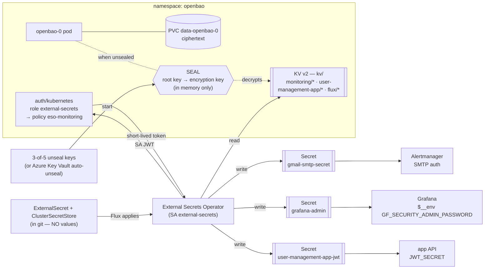

# AKS GitOps — user-management-app, Grafana, Prometheus alerting, full CI/CD

A reference setup for running one application through **dev → qa → prod** on AKS the
**GitOps + Kubernetes operator** way, with a real CI/CD pipeline gated by Flux:

- **user-management-app** — React UI + Node API + Postgres (CloudNativePG), deployed by
  **Flux + Kustomize** into `dev`, `qa`, `prod` namespaces
- **Prometheus** (kube-prometheus-stack) scraping it
- **Grafana** run *in the cluster*, dashboards/datasource/folders managed as
  **`Grafana*` custom resources** by the **Grafana Operator** — no clicking in the UI
- **alerting** as **`PrometheusRule` + `AlertmanagerConfig` custom resources** → email
- **secrets** — External Secrets Operator + **OpenBao** (open-source Vault), nothing
  sensitive in git
- **CI/CD** — GitHub Actions builds/tests/scans; **Flux Image Automation** keeps dev
  current; **qa/prod are promoted by a gated, reviewable workflow**, not by hand
- **permanent public URLs** via Azure DNS labels

Everything is declared in this git repo. Nothing is `kubectl apply`-ed by hand; nothing
is configured in a UI. No Azure-native monitoring is used — this runs its **own**
Prometheus and Grafana. (The Azure portal's *Monitoring → Dashboards with Grafana* is a
*different*, Azure-managed Grafana; our dashboards do not appear there.)

| Deep dive | |
|---|---|
| Apps overview | [`apps/README.md`](apps/README.md) |
| **user-management-app** (React + Node + Postgres, migrations, reset, local test) | [`apps/user-management-app/README.md`](apps/user-management-app/README.md) |
| Prometheus backend | [`infrastructure/prometheus/README.md`](infrastructure/prometheus/README.md) |
| Grafana + how to add dashboards + the URL/PVC | [`infrastructure/grafana/README.md`](infrastructure/grafana/README.md) |
| Alerting + how to add rules | [`infrastructure/alert/README.md`](infrastructure/alert/README.md) |
| Secret management (ESO + OpenBao) | [`infrastructure/secrets/README.md`](infrastructure/secrets/README.md) |
| CloudNativePG operator | [`infrastructure/cnpg/README.md`](infrastructure/cnpg/README.md) |
| Flux Image Automation (CD to dev) | [`infrastructure/flux-image-automation/README.md`](infrastructure/flux-image-automation/README.md) |
| **Build from scratch (shareable runbook)** | [§3](#3-build-this-from-scratch--step-by-step) |
| **CI/CD pipeline (dev/qa/prod promotion)** | [§6](#6-cicd-pipeline) |
| **Rollback** | [§9](#9-rollback) |
| **Scope & roadmap (multi-cloud / EKS)** | [§10](#10-scope--roadmap) |
| **Tear down to save cost / stand back up** | [§13](#13-tear-down-to-save-cost--and-stand-back-up) |

---

## Quick reference (this deployment)

| | |
|---|---|
| Cluster | `san-dev-aks` / RG `san-rg` / sub `bf286ce3-6142-41dc-9c9b-fd993989df20` / `eastus2` |
| Repo | `https://github.com/sandeshlamsal/Devops_Aks_Gitops_Grafana_Alert` branch `main` |
| Flux config | `platform-config` (AKS Flux extension, namespace `flux-system`) — earlier bootstraps used the name `nginx-demo-config`; either works, just be consistent in your own `az` commands and the `FLUX_KUSTOMIZATION_PREFIX` CI variable (§6) |
| **Grafana** | **http://usermgmt-grafana.eastus2.cloudapp.azure.com** — `admin` / password from OpenBao (`kv/monitoring/grafana-admin`); **User Management App** dashboard in folder **Custom Application Dashboards** |
| **App UI** | **http://user-management-dev.eastus2.cloudapp.azure.com** · **…-qa…** · **…-prod…** — log in `admin` / `password123`, then see the user list |
| App namespaces | `user-management-app-dev-ns` (armed/auto), `-qa-ns` (PR-gated, 1h), `-prod-ns` (PR-gated, environment-approved) |
| Platform namespaces | `monitoring`, `external-secrets`, `openbao`, `cnpg-system`, `flux-system` |
| Secrets | values only in OpenBao — `kv/monitoring/{gmail-smtp,grafana-admin}`, `kv/user-management-app/jwt`, `kv/flux/{git-credentials,acr-pull}`; Postgres creds generated by CNPG |
| Alert | `UserManagementAppPodRestarting` → email `parasisandesh@hotmail.com` (Gmail SMTP) |
| **Flux Kustomizations ship `suspend: true`** | dev/qa/prod deploy nothing until "armed" by a `promote-*` GitHub Actions workflow (§6) |

### Public FQDNs

| Service | URL |
|---|---|
| Grafana | http://usermgmt-grafana.eastus2.cloudapp.azure.com |
| App UI — dev | http://user-management-dev.eastus2.cloudapp.azure.com |
| App UI — qa | http://user-management-qa.eastus2.cloudapp.azure.com |
| App UI — prod | http://user-management-prod.eastus2.cloudapp.azure.com |
| App API (any env) | via the UI proxy: `…/api/*` · in-cluster: `user-management-app-api.user-management-app-<env>-ns.svc.cluster.local:8080` |
| App DB (any env) | in-cluster only: `user-management-app-db-rw.user-management-app-<env>-ns.svc.cluster.local:5432` (CNPG; also `-ro`, `-r`) |

Full table + `port-forward` recipes in [`apps/user-management-app/README.md`](apps/user-management-app/README.md#endpoints--fqdns).

---

## 1. How it fits together

```
 GitHub repo (main) ─► Flux (source-controller pulls; kustomize-controller applies;
                              helm-controller installs charts)
        │
        ├─ Kustomization: prometheus        → HelmRelease kube-prometheus-stack
        │      installs Prometheus + Prometheus Operator + Alertmanager
        │
        ├─ Kustomization: grafana-operator  → HelmRelease grafana-operator   (dependsOn prometheus)
        ├─ Kustomization: grafana           → Grafana / GrafanaDatasource / GrafanaFolder /
        │      (dependsOn grafana-operator)   GrafanaDashboard CRs → "User Management App" dashboard
        │
        ├─ Kustomization: alert             → PrometheusRule + AlertmanagerConfig CRs
        │      (dependsOn prometheus, secrets)  UserManagementAppPodRestarting → email
        │
        ├─ Kustomization: external-secrets-operator / openbao / secrets
        │      ESO reads OpenBao → writes Secrets (gmail-smtp, grafana-admin, app JWT, …)
        │
        ├─ Kustomization: cnpg-operator     → CloudNativePG operator (+ CRDs)
        │
        ├─ Kustomization: user-management-app-dev   (suspend: true — armed by promote-dev.yml)
        ├─ Kustomization: user-management-app-qa    (suspend: true, interval 1h — armed by promote-qa.yml)
        ├─ Kustomization: user-management-app-prod  (suspend: true — armed by promote-prod.yml, environment-gated)
        │      each: CNPG Cluster + api + ui + migrate Job + reset CronJob + ServiceMonitor
        │
        └─ Kustomization: flux-image-automation
               ImageRepository/ImagePolicy watch ACR "dev-<N>" tags → ImageUpdateAutomation
               commits the bump straight into the dev overlay (continuous deployment "from Flux")

 GitHub Actions: ci.yml (test+build+push on every merge to main, tags dev-<run>/main-<sha>)
                 release.yml (build+push+scan on a vX.Y.Z tag — build once)
                 promote-dev.yml / promote-qa.yml / promote-prod.yml
                     → bump the target overlay (PR for qa/prod) + RESUME (arm) its
                       suspended Flux Kustomization — see §6

 app pod ─/metrics─► Prometheus ─datasource─► Grafana dashboard
                │ evaluates PrometheusRule
                ▼
           Alertmanager ◄─ AlertmanagerConfig (route + email receiver)
                │ UserManagementAppPodRestarting fires
                ▼
     email via Gmail SMTP ─► recipient (SMTP password: OpenBao → ESO → Secret)
```

**The operator idea, in one paragraph.** A Helm chart installs a *controller* that watches
*custom resources*. You write a small YAML object (`GrafanaDashboard`, `PrometheusRule`,
`ImagePolicy`, …); the controller reconciles it into the running system. Flux delivers
those YAML objects from git. So "add a dashboard", "add an alert", or "promote a
release" = commit a file / merge a PR — no imperative steps, and the cluster self-heals
to match git.

---

## 2. Repository layout

```
apps/
  README.md                   apps overview + the base/overlay pattern
  user-management-app/        React UI + Node API + Postgres — the one app in this repo
    api/                       Node/Express source + migrations/*.sql + unit tests + Dockerfile
    ui/                        React (Vite) source + nginx.conf + Dockerfile
    docker-compose.yml         local Docker Desktop test rig (same images, same env var names as k8s)
    .env.example               template for docker-compose.yml (gitignored .env holds real local values)
    k8s/base/                  CNPG Cluster, api, ui, migrate Job, suspended reset CronJob, ExternalSecret
    k8s/overlays/dev|qa|prod/  → user-management-app-{dev,qa,prod}-ns
    README.md

infrastructure/
  prometheus/                 kube-prometheus-stack Helm install + the monitoring namespace
  secrets/                    External Secrets Operator + OpenBao — no secret values in git
    operator/                 ESO Helm install — its OWN Flux Kustomization
    openbao/                  OpenBao (OSS Vault fork) Helm install — its OWN Flux Kustomization
    stores/                   ClusterSecretStore → OpenBao
    externalsecrets/          ExternalSecret CRs → gmail-smtp-secret, grafana-admin
  cnpg/                       CloudNativePG operator Helm install — its OWN Flux Kustomization
  grafana/
    operator/                 the Grafana Operator Helm install — its OWN Flux Kustomization
    grafana.yaml              Grafana instance CR (LoadBalancer :80 + Azure DNS label + PVC)
    folder.yaml               GrafanaFolder "Custom Application Dashboards"
    dashboard.yaml            GrafanaDashboard CR → the ConfigMap key, filed in the folder
    json/user-management-app.json   the dashboard model (plain Grafana JSON, has a Namespace picker)
  alert/
    alertmanager-config.yaml  AlertmanagerConfig — routing + Gmail email receiver
    rules/api-restarts.yaml   PrometheusRule — UserManagementAppPodRestarting
  flux-image-automation/      ImageRepository/ImagePolicy/ImageUpdateAutomation — CD to dev, from Flux

.github/workflows/
  ci.yml                      validate manifests, unit+integration test the API, build (+push on main)
  release.yml                 build+push+scan release images on a vX.Y.Z tag (build once)
  promote-dev.yml             arm dev's Flux Kustomization (+ optional manual tag pin)
  promote-qa.yml               verify → bump qa overlay (PR) → arm qa
  promote-prod.yml             verify → bump prod overlay (PR, environment-gated) → arm prod

clusters/dev/                 human-readable copies of the Flux Kustomizations (see §3.5)
```

Each `apps/*` and `infrastructure/*` folder has its own README.

---

## 3. Build this from scratch — step by step

> Shareable runbook: from an empty AKS cluster to a working, gated CI/CD pipeline.
> Replace `san-rg`, `san-dev-aks`, the subscription id, the repo URL, the DNS labels and
> the email addresses with your own.

### 3.0 Prerequisites

- an AKS cluster and `kubectl` context for it
- `az` CLI logged in; `kubectl`; optionally the `flux` CLI (nicer status output)
- an ACR the cluster can pull from
- a Gmail account with 2-Step Verification + an **app password** (for alert email)
- a GitHub repo (this one, or your fork) with Actions enabled

```bash
az account set --subscription <SUBSCRIPTION_ID>
az aks get-credentials -g <RG> -n <CLUSTER>
```

### 3.1 Build & push the app images

Cloud-build straight into ACR (no local Docker needed) for the first deploy — after
that, CI does this on every push (§6):

```bash
az acr build --registry <ACR_NAME> --image user-management-app-api:v1 ./apps/user-management-app/api
az acr build --registry <ACR_NAME> --image user-management-app-ui:v1  ./apps/user-management-app/ui
az aks update -g <RG> -n <CLUSTER> --attach-acr <ACR_NAME>
```

If your registry isn't `sanaksregistry`, update the `images:` blocks in
`apps/user-management-app/k8s/overlays/{dev,qa,prod}/kustomization.yaml`.

**Test locally first** — build and run the exact same images in Docker Desktop before
touching the cluster: [apps/user-management-app/README.md → Local Docker Desktop test](apps/user-management-app/README.md#local-docker-desktop-test).

### 3.2 Secrets — nothing is created by hand

Secret **values** never touch the repo. **External Secrets Operator** + **OpenBao** (see
`infrastructure/secrets/`) sync them into Kubernetes Secrets the apps consume:
`gmail-smtp-secret` (Alertmanager), `grafana-admin` (Grafana), `user-management-app-jwt`
(API). Postgres credentials are generated by CloudNativePG, not OpenBao. CI/CD needs two
more (§6): `kv/flux/git-credentials`, `kv/flux/acr-pull`.

The only manual step is a **one-time OpenBao bootstrap** (init → unseal → enable KV +
Kubernetes auth → policy → seed the values), done *after* Flux installs OpenBao in §3.7
— full command block in
[`infrastructure/secrets/README.md`](infrastructure/secrets/README.md#bootstrap-openbao-one-time--first-install-or-after-any-tier--2-rebuild).

```bash
bao policy write eso-monitoring - <<'EOF'
path "kv/data/monitoring/*"          { capabilities = ["read"] }
path "kv/data/user-management-app/*" { capabilities = ["read"] }
path "kv/data/flux/*"                { capabilities = ["read"] }
EOF
bao kv put kv/monitoring/gmail-smtp    password='YOUR_GMAIL_APP_PASSWORD'
bao kv put kv/monitoring/grafana-admin password='A_STRONG_ADMIN_PASSWORD'
bao kv put kv/user-management-app/jwt  secret="$(openssl rand -hex 32)"
```

Update `to:` / `from:` / `authUsername:` in `infrastructure/alert/alertmanager-config.yaml`
to your addresses.

### 3.3 Pick DNS labels

Edit `infrastructure/grafana/grafana.yaml` (Grafana) and
`apps/user-management-app/k8s/overlays/{dev,qa,prod}/patch.yaml` (the app UI) — each
`service.beta.kubernetes.io/azure-dns-label-name` must be **unique in your region** and
must **not** contain a reserved word (Azure rejects e.g. anything with `login` —
`DomainNameLabelReserved`; that's why this repo uses `user-management-*`, not
`userlogin-*`). Keep `spec.config.server.domain` / `root_url` on `grafana.yaml` in sync.

### 3.4 Point this repo at your fork/branch

Push this tree to your own git repo. Note the URL + branch for the next step.

### 3.5 Install the Flux extension + configuration on AKS

```bash
az provider register --namespace Microsoft.KubernetesConfiguration

az k8s-extension create \
  -g <RG> -c <CLUSTER> -t managedClusters \
  --name flux --extension-type microsoft.flux

az k8s-configuration flux create \
  -g <RG> -c <CLUSTER> -t managedClusters \
  --name platform-config --namespace flux-system \
  --url <YOUR_REPO_URL> --branch main \
  --kustomization name=prometheus               path=./infrastructure/prometheus      prune=true \
  --kustomization name=external-secrets-operator path=./infrastructure/secrets/operator prune=true \
  --kustomization name=openbao                  path=./infrastructure/secrets/openbao prune=true \
  --kustomization name=secrets                  path=./infrastructure/secrets         prune=true dependsOn=["external-secrets-operator","openbao","prometheus"] \
  --kustomization name=grafana-operator         path=./infrastructure/grafana/operator prune=true dependsOn=["prometheus"] \
  --kustomization name=grafana                  path=./infrastructure/grafana         prune=true dependsOn=["grafana-operator","secrets"] \
  --kustomization name=alert                    path=./infrastructure/alert           prune=true dependsOn=["prometheus","secrets"] \
  --kustomization name=cnpg-operator            path=./infrastructure/cnpg            prune=true \
  --kustomization name=user-management-app-dev  path=./apps/user-management-app/k8s/overlays/dev  prune=true dependsOn=["cnpg-operator","secrets"] \
  --kustomization name=user-management-app-qa   path=./apps/user-management-app/k8s/overlays/qa   prune=true dependsOn=["cnpg-operator","secrets"] \
  --kustomization name=user-management-app-prod path=./apps/user-management-app/k8s/overlays/prod prune=true dependsOn=["cnpg-operator","secrets"] \
  --kustomization name=flux-image-automation    path=./infrastructure/flux-image-automation prune=true dependsOn=["secrets"]
```

The AKS CLI wrapper has no `--suspend` flag — the three app Kustomizations come up
**not suspended** from this command. Immediately lock them (see §6 for why):

```bash
for k in dev qa prod; do
  kubectl -n flux-system patch kustomization "platform-config-user-management-app-$k" \
    --type merge -p '{"spec":{"suspend":true}}'
done
```

**Ordering (`dependsOn`):** `prometheus` → `grafana-operator` → `grafana`;
`external-secrets-operator` + `openbao` → `secrets` → `grafana` + `alert` +
`flux-image-automation`; `cnpg-operator` + `secrets` → `user-management-app-{dev,qa,prod}`.
Anything that *installs* CRDs (`*-operator`, `openbao`) is its own Kustomization — Flux
refuses to apply a Kustomization containing a CR whose CRD is not registered yet.

### 3.6 One-time RBAC for the new namespaces

The AKS Flux extension impersonates a `flux-applier` ServiceAccount **in the namespace
each resource lands in**, but only provisions that SA for namespaces it knows about
(here: just `flux-system`, because no `--kustomization` sets `targetNamespace`). Our
HelmReleases and app resources declare their own `metadata.namespace`, so each target
namespace needs the SA too, or helm-/kustomize-controller fails with
`serviceaccount "flux-applier" ... cannot list resource "secrets"`.

**Run this *before* §3.5** (create the namespaces + SAs + bindings first) so the first
reconcile has no failure window:

```bash
for ns in monitoring openbao external-secrets cnpg-system \
          user-management-app-dev-ns user-management-app-qa-ns user-management-app-prod-ns; do
  kubectl create namespace "$ns" --dry-run=client -o yaml | kubectl apply -f -
  kubectl create serviceaccount flux-applier -n "$ns" --dry-run=client -o yaml | kubectl apply -f -
  kubectl create clusterrolebinding "flux-applier-$ns" --clusterrole=cluster-admin \
    --serviceaccount="$ns:flux-applier" --dry-run=client -o yaml | kubectl apply -f -
done
```

(Alternative: recreate the config passing `targetNamespace=<ns>` on every
`--kustomization` so the extension provisions the SAs itself.)

### 3.7 Wait, then bootstrap OpenBao

```bash
kubectl get kustomization -n flux-system -w        # names are prefixed platform-config-*
kubectl get helmrelease -A                         # kube-prom-stack, grafana-operator, external-secrets, openbao, cloudnative-pg
kubectl get pods -n openbao                        # openbao-0 Running but 0/1 → it starts SEALED
```

**`openbao` / `secrets` (and thus `grafana`, `alert`, `flux-image-automation`) stay
not-ready until you bootstrap OpenBao once.** Full command block:
[`infrastructure/secrets/README.md` → Bootstrap OpenBao](infrastructure/secrets/README.md#bootstrap-openbao-one-time--first-install-or-after-any-tier--2-rebuild).

Then it converges — except the three app Kustomizations, which stay `suspend: true`
until §6's `promote-*` workflows arm them:

```bash
kubectl get externalsecret -n monitoring          # gmail-smtp-secret, grafana-admin → SecretSynced=True
kubectl get kustomization -n flux-system          # all → READY=True except the suspended user-management-app-* ones
kubectl get pods -n monitoring                    # prometheus-*, alertmanager-*, grafana-*, *-operator-*
```

### 3.8 Get the Grafana URL

```bash
kubectl get svc grafana-service -n monitoring -o jsonpath='{.status.loadBalancer.ingress[0].ip}'
# http://<your Grafana DNS label>.<region>.cloudapp.azure.com
```

Login `admin` / the password you seeded in OpenBao → **Dashboards → Custom Application
Dashboards → User Management App** → use the **Namespace** picker.

### 3.9 Set up CI/CD, then promote dev

Continue at [§6](#6-cicd-pipeline) — configure the GitHub OIDC app + repo variables,
then run **Promote to dev** once to arm it. Flux Image Automation + CI take it from there.

---

## 4. DNS & the permanent URL

Every public Service (Grafana, and each app UI) is `type: LoadBalancer` with an Azure
DNS label annotation:

```yaml
spec:
  service:
    metadata:
      annotations:
        service.beta.kubernetes.io/azure-dns-label-name: "usermgmt-grafana"
    spec:
      type: LoadBalancer
      ports:
        - { name: grafana-http, port: 80, targetPort: 3000, protocol: TCP }   # no :3000 in the URL
```

- The Azure cloud-controller-manager creates a **managed Public IP** and attaches the
  DNS label → `<label>.<region>.cloudapp.azure.com`.
- The hostname stays attached to that IP; if the Service is recreated Azure keeps the
  label with the config, so the **URL is stable to share**.
- **Reserved words**: Azure rejects a label containing certain words (`login` is one —
  `DomainNameLabelReserved`). Test a new label before relying on it.

Check it:

```bash
dig +short usermgmt-grafana.eastus2.cloudapp.azure.com
curl -s http://usermgmt-grafana.eastus2.cloudapp.azure.com/api/health
```

### Custom domain + HTTPS (recommended for real use)

Plain HTTP on a `cloudapp.azure.com` name is fine for a dev/demo. For production put it
behind TLS:

1. Install **ingress-nginx** and **cert-manager** (Helm), or use AGIC.
2. Switch the Service back to `type: ClusterIP` (drop the DNS-label annotation).
3. Add an `Ingress` with your hostname, an `ingressClassName`, and a cert-manager
   `cluster-issuer` annotation.
4. Point a CNAME from `app.yourcompany.com` at the ingress controller's LB.
5. Set the app's / Grafana's `root_url` to `https://app.yourcompany.com/`.

---

## 5. Secrets & security

### 5.1 Secret management with OpenBao + External Secrets Operator

**Why not plain Kubernetes Secrets?** They're base64 (not encryption), readable by anyone
who can `get secret`, live in etcd, and are one careless `kubectl apply -f` away from git.
This repo keeps **zero secret values in version control**.

**The two pieces**

| | |
|---|---|
| **OpenBao** (`infrastructure/secrets/openbao/`) | The vault. Stores secrets encrypted at rest, with access policies, an audit log, versioning and rotation. Open-source (MPL-2.0, Linux Foundation) — the fork of HashiCorp Vault; API-compatible with it. |
| **External Secrets Operator** (`infrastructure/secrets/operator/`) | The bridge. Reconciles `ExternalSecret` CRs: authenticates to OpenBao with its Kubernetes ServiceAccount, reads a path, and writes a normal `Secret` that apps consume. `refreshInterval` re-syncs, so rotating in OpenBao propagates automatically. |



Every secret in this system lives only in OpenBao. Add another with one `bao kv put` +
one `ExternalSecret` — worked examples in
[`infrastructure/secrets/README.md`](infrastructure/secrets/README.md#add-a-new-secret--worked-examples),
which also covers the ServiceAccounts, seal/unseal, and Azure Key Vault auto-unseal in
depth.

### 5.2 Seal / unseal — the core OpenBao concept

OpenBao encrypts all its data with an **encryption key**, and that key is itself
encrypted by the **root key** (a.k.a. master key). On disk everything is ciphertext.

When OpenBao starts it is **sealed**: it has the ciphertext but *not* the root key in
memory, so it can decrypt nothing and every API call returns `503`.

**Unsealing** reconstructs the root key in memory:

```
unseal key shares  ──(Shamir's Secret Sharing, 3-of-5)──►  root / master key
                                                                │ decrypts
                                                           encryption key
                                                                │ decrypts
                                                           your secrets (kv/…)
```

- `bao operator init` (once) generates the root key and splits it into **5 unseal key
  shares** with a **threshold of 3**. No single share reveals anything; any 3 reconstruct
  the root key. The shares + the initial root token are **printed once** — store the
  shares separately (different people / vaults). Lose 3 of 5 → data is unrecoverable.
- `bao operator unseal <share>` × 3 → OpenBao rebuilds the root key → decrypts the
  encryption key → **unsealed**, serving.
- A restart (pod reschedule, node reboot, `az aks stop`/`start`) **re-seals** — you unseal
  again. This is why manual unseal doesn't scale for 24×7 systems.

This repo uses **Shamir / manual unseal** because it needs nothing extra to provision.
The one-time bootstrap is in
[`infrastructure/secrets/README.md`](infrastructure/secrets/README.md#bootstrap-openbao-one-time--first-install-or-after-any-tier--2-rebuild).

### 5.3 Auto-unseal — how the master key is protected by a KMS

**Auto-unseal** removes humans from the startup path by delegating protection of the root
key to an external KMS — **Azure Key Vault** (or AWS/GCP KMS, or another OpenBao's
`transit` engine).

- At `init`, OpenBao generates the root key and immediately asks the KMS to **wrap**
  (encrypt) it; only the wrapped blob is written to disk. The plaintext root key is never
  persisted.
- On **every startup** OpenBao sends the wrapped blob to the KMS; the KMS **unwraps** it
  using a key that never leaves the KMS/HSM; OpenBao gets the root key back in memory →
  **auto-unsealed**, no shares, no humans.
- Shamir shares are replaced by **recovery keys** (still 3-of-5) — used only for
  break-glass operations (regenerate the root token, rekey), never for routine startup.
- Trust moves to the KMS: access is gated by Azure RBAC + a managed / workload identity,
  and the key can sit in a FIPS-140 HSM.

To switch this repo to Azure Key Vault auto-unseal, replace the `server.standalone.config`
HCL in `infrastructure/secrets/openbao/openbao.yaml` with:

```hcl
seal "azurekeyvault" {
  tenant_id  = "<AAD_TENANT_ID>"
  vault_name = "<KEYVAULT_NAME>"
  key_name   = "openbao-unseal"
  # credentials come from the pod's AKS workload identity — no client secret in config
}
storage "file" { path = "/openbao/data" }
listener "tcp" { address = "[::]:8200"; tls_disable = 1 }
```

plus: a Key Vault + an RSA/AES key named `openbao-unseal`; the `Key Vault Crypto User`
role for OpenBao's identity; AKS **workload identity** federated to OpenBao's
ServiceAccount. Then `bao operator init` prints **recovery** keys and the pod comes up
unsealed on its own — including after `az aks start`.

### 5.4 Hardening checklist

| Area | State in this repo | Go further |
|---|---|---|
| Secret management | External Secrets Operator + OpenBao. No secret values in git. | OpenBao HA (Raft) + auto-unseal (Azure Key Vault); short-lived tokens; per-app policies; audit device |
| CI/CD credentials | Azure OIDC federated identity for `azure/login` — no stored client secret. GitHub PAT + ACR token live only in OpenBao. | rotate the PAT/ACR token periodically; scope the Azure AD app's role assignment as tightly as possible (`AcrPush` + AKS RBAC reader, nothing broader) |
| Environment gating | dev/qa/prod Flux Kustomizations ship `suspend: true`; only a `promote-*` workflow arms them; prod additionally requires the GitHub Environment `production` (§6) | require reviewers on `production` (and optionally `qa`) in repo Settings → Environments |
| Grafana admin password | `$__env{GF_SECURITY_ADMIN_PASSWORD}` ← Secret ← OpenBao | rotate in OpenBao; ESO re-syncs on `refreshInterval` |
| Gmail SMTP password | Secret ← OpenBao | rotate the app password; or a real transactional-mail provider |
| Public exposure | `LoadBalancer`, HTTP :80, for Grafana + each app UI | ClusterIP + Ingress + TLS (§4); `loadBalancerSourceRanges` to restrict source IPs if keeping the LB |
| Grafana anonymous access | off (login required) | keep off; wire SSO (`auth.azuread` / `auth.generic_oauth`) |
| Alertmanager / Prometheus / OpenBao UIs | ClusterIP only, reachable via `port-forward` | keep internal |
| RBAC | Flux applies with `flux-applier` (cluster-admin via the extension) | scope Flux down with per-Kustomization service accounts |
| Container security | Grafana runs as uid/gid 472 with `fsGroup: 472` | `readOnlyRootFilesystem`, drop capabilities, NetworkPolicies |

---

## 6. CI/CD pipeline

**dev is continuous, qa/prod are gated.** All three environments' Flux Kustomizations
ship `spec.suspend: true` — nothing deploys anywhere until a `promote-*` workflow
explicitly arms (resumes) that environment. Once armed, an environment *stays* armed;
"promote" both ships a change and (the first time) unlocks that environment.

```
push to main
   │ ci.yml: validate manifests → unit+integration test the API (real Postgres) → build
   │         → push user-management-app-{api,ui}:dev-<run_number> + :main-<sha> → scan
   ▼
Flux Image Automation (infrastructure/flux-image-automation/, "from Flux")
   watches ACR, picks the highest dev-<N>, commits the bump into
   apps/user-management-app/k8s/overlays/dev/kustomization.yaml on main
   │
   ▼
"Promote to dev" (workflow_dispatch)  ──arms──►  Kustomization user-management-app-dev
   (only needed once, or after a manual suspend)         reconciles every 5m

git tag vX.Y.Z pushed
   │ release.yml: build+push+scan user-management-app-{api,ui}:vX.Y.Z  (build once)
   ▼
"Promote to qa" (workflow_dispatch, version: vX.Y.Z)
   verify vX.Y.Z exists in ACR → bump qa overlay → open PR → arm qa (resume)
   │  human reviews + merges the PR
   ▼
   Kustomization user-management-app-qa reconciles within 1h of merge

"Promote to prod" (workflow_dispatch, version: vX.Y.Z; gated by GitHub Environment "production")
   same shape as qa, but the run itself pauses for required-reviewer approval
   (if configured) before anything happens → verify → bump prod overlay → PR → arm prod
   │  human reviews + merges the PR
   ▼
   Kustomization user-management-app-prod reconciles within 5m of merge
```

**Build once, promote the same artifact.** `release.yml` builds `vX.Y.Z` a single time;
`promote-qa.yml` and `promote-prod.yml` never rebuild — they re-tag the *same* image
into the next environment's overlay. What ran in qa is byte-for-byte what reaches prod.

### One-time setup

1. **Azure AD app + OIDC federated credentials** (no client secret stored anywhere):

   ```bash
   APP_ID=$(az ad app create --display-name gh-actions-devops-repo --query appId -o tsv)
   az ad sp create --id "$APP_ID"

   # main branch (covers ci.yml push-to-main, and workflow_dispatch runs on main)
   az ad app federated-credential create --id "$APP_ID" --parameters '{
     "name": "gh-main", "issuer": "https://token.actions.githubusercontent.com",
     "subject": "repo:sandeshlamsal/Devops_Aks_Gitops_Grafana_Alert:ref:refs/heads/main",
     "audiences": ["api://AzureADTokenExchange"]}'

   # the "production" GitHub Environment (promote-prod.yml runs under it)
   az ad app federated-credential create --id "$APP_ID" --parameters '{
     "name": "gh-prod-env", "issuer": "https://token.actions.githubusercontent.com",
     "subject": "repo:sandeshlamsal/Devops_Aks_Gitops_Grafana_Alert:environment:production",
     "audiences": ["api://AzureADTokenExchange"]}'

   az role assignment create --assignee "$APP_ID" --role AcrPush \
     --scope "$(az acr show -n sanaksregistry --query id -o tsv)"
   az role assignment create --assignee "$APP_ID" --role "Azure Kubernetes Service Cluster User Role" \
     --scope "$(az aks show -g san-rg -n san-dev-aks --query id -o tsv)"
   ```

   > **Tag-triggered `release.yml` and OIDC:** Azure AD federated credentials match an
   > **exact** subject string, and a git tag's name varies, so a single credential can't
   > cover every future `vX.Y.Z`. Two ways to close this: (a) if your tenant supports
   > federated-credential **claims-matching expressions**, use one matching
   > `refs/tags/*`; (b) simpler — keep `release.yml` triggered by tag push (it only needs
   > `AcrPush`, not cluster access), and grant the `gh-main` credential's app the
   > `AcrPush` role too, then trigger the actual build via `workflow_dispatch` from
   > `main` instead of the tag event if your tenant has no wildcard support.

2. **GitHub repo → Settings → Secrets and variables → Actions → Variables** (not
   secrets — none of these are sensitive on their own):

   | Variable | Example |
   |---|---|
   | `AZURE_CLIENT_ID` | the `APP_ID` above |
   | `AZURE_TENANT_ID` | `az account show --query tenantId -o tsv` |
   | `AZURE_SUBSCRIPTION_ID` | `bf286ce3-6142-41dc-9c9b-fd993989df20` |
   | `ACR_NAME` | `sanaksregistry` |
   | `AKS_RESOURCE_GROUP` | `san-rg` |
   | `AKS_CLUSTER_NAME` | `san-dev-aks` |
   | `FLUX_KUSTOMIZATION_PREFIX` | `platform-config-` (the AKS Flux config name + `-`) |

3. **GitHub repo → Settings → Environments → New environment → `production`** — add
   required reviewers here if you want a human approval gate before `promote-prod.yml`
   can run. (Optionally also create a `qa` environment and reference it in
   `promote-qa.yml`'s job if you want the same gate there.)

4. **OpenBao secrets for the pipeline itself** — see
   [`infrastructure/flux-image-automation/README.md`](infrastructure/flux-image-automation/README.md)
   for generating the GitHub PAT (`kv/flux/git-credentials`) and the scoped ACR pull
   token (`kv/flux/acr-pull`) that Flux Image Automation needs.

### Running a promotion

```text
Actions tab → "Promote to dev"  → Run workflow                       (arm dev once)
Actions tab → "Promote to qa"   → Run workflow → version: v1.2.3      (after: git tag v1.2.3 && git push --tags)
Actions tab → "Promote to prod" → Run workflow → version: v1.2.3      (after qa looks good)
```

### Local test before any of this

Run the whole 3-service app locally in Docker Desktop, with the exact env var names the
k8s manifests use, before it ever reaches AKS:
[apps/user-management-app/README.md → Local Docker Desktop test](apps/user-management-app/README.md#local-docker-desktop-test).
The API's unit + integration test suite (`node --test`, real Postgres, zero mocking) is
what `ci.yml` runs before any image is built — a code change that breaks a test never
produces an image.

---

## 7. End-to-end alert test

`UserManagementAppPodRestarting` fires when an `api` or `ui` container restarts, in
**any** namespace.

### 7.1 Trigger

```bash
kubectl exec -n user-management-app-dev-ns deploy/user-management-app-api -c api -- kill 1
kubectl get pods -n user-management-app-dev-ns \
  -o custom-columns='POD:.metadata.name,RESTARTS:.status.containerStatuses[*].restartCount' -w
```

### 7.2 Watch inactive → pending → firing

```bash
kubectl port-forward -n monitoring svc/kube-prom-stack-kube-prome-prometheus 9090:9090 &
kubectl port-forward -n monitoring svc/kube-prom-stack-kube-prome-alertmanager 9093:9093 &

watch -n5 'curl -s http://localhost:9090/api/v1/rules \
  | jq -r ".data.groups[].rules[] | select(.name==\"UserManagementAppPodRestarting\") | .state, (.alerts[]?.labels.namespace)"'

curl -s http://localhost:9093/api/v2/alerts \
  | jq -r '.[] | select(.labels.alertname=="UserManagementAppPodRestarting") | "\(.labels.namespace)\t\(.status.state)"'
```

Observed: `inactive` → `pending` (~30s, one scrape) → `firing` (after `for: 1m`) → shows
in Alertmanager tagged with the real namespace → email sent.
Browser: http://localhost:9090/alerts · http://localhost:9093

### 7.3 No email?

```bash
kubectl logs -n monitoring alertmanager-kube-prom-stack-kube-prome-alertmanager-0 \
  -c alertmanager --tail=100 | grep -iE 'smtp|email|notify|error'

curl -s http://localhost:9093/api/v2/status | jq -r '.config.original' | grep -A15 'receivers:'

kubectl get secret gmail-smtp-secret -n monitoring -o jsonpath='{.data.password}' | base64 -d | wc -c
```

Common causes: secret missing / wrong key, expired Gmail app password, or the
`PrometheusRule` missing the `release: kube-prom-stack` label so it never loaded.

---

## 8. Day-to-day

```bash
# after any git push:
flux reconcile source git platform-config -n flux-system
flux reconcile kustomization platform-config-grafana -n flux-system

# check what's suspended
kubectl get kustomization -n flux-system -o custom-columns='NAME:.metadata.name,SUSPEND:.spec.suspend,READY:.status.conditions[?(@.type=="Ready")].status'

# manage the AKS Flux config
az k8s-configuration flux kustomization create -g <RG> -c <CLUSTER> -t managedClusters \
  --name platform-config --kustomization-name my-new-thing --path ./infrastructure/my-new-thing --prune true
az k8s-configuration flux show -g <RG> -c <CLUSTER> -t managedClusters \
  --name platform-config --query provisioningState -o tsv      # wait for Succeeded between ops
```

`prune=true` ⇒ deleting a file deletes the resource on the next reconcile.

**Grafana persistence.** Grafana keeps its SQLite DB on a 2Gi PVC (`grafana-pvc`,
mounted at `/var/lib/grafana`, `fsGroup: 472`). Dashboards/datasource/folders survive pod
restarts. They are still declared in git — the operator re-pushes them on each
`resyncPeriod`, and a UI edit is overwritten.

---

## 9. Rollback

Every change that reaches a cluster is a git commit — rollback is always "get git back
to the previous state," never a cluster-side hack.

| Environment | What happened | How to roll back |
|---|---|---|
| **dev** | Flux Image Automation auto-committed a bad `dev-<N>` tag | `git log --oneline --author=fluxcdbot -5` → `git revert <sha> && git push`. Flux reconciles the revert within 5m. |
| **dev** | need it stopped *right now* | `kubectl -n flux-system patch kustomization platform-config-user-management-app-dev --type merge -p '{"spec":{"suspend":true}}'` — instantly stops further reconciles (doesn't undo what's already applied; pair with a revert). |
| **qa** | a promoted version misbehaves | Revert the merged `release/vX.Y.Z-qa` PR on GitHub (button) and merge the revert, **or** re-run **Promote to qa** with the previous good `version`. Either way, wait up to 1h (qa's interval) or `flux reconcile kustomization platform-config-user-management-app-qa -n flux-system` to force it now. |
| **prod** | same, higher stakes | Revert the merged `release/vX.Y.Z-prod` PR, **or** re-run **Promote to prod** with the previous version (goes through the same `production` environment approval gate — by design, rolling back prod is reviewed too). `flux reconcile kustomization platform-config-user-management-app-prod -n flux-system` to force it now. |
| **any env, emergency freeze** | stop deployments while investigating, without touching what's already running | `kubectl -n flux-system patch kustomization platform-config-user-management-app-<env> --type merge -p '{"spec":{"suspend":true}}'` |
| **DB migration went wrong** | schema/fixtures broken in one namespace | `kubectl -n user-management-app-<env>-ns create job db-reset-$(date +%s) --from=cronjob/user-management-app-db-reset` — drops, re-migrates, re-seeds *that namespace's* database. See [apps/user-management-app/README.md](apps/user-management-app/README.md). |
| **OpenBao secret rotated to a bad value** | app can't auth / send mail | `bao kv put kv/<path> <field>='<previous value>'` — ESO re-syncs on its `refreshInterval` (default 1h) or force with `kubectl annotate externalsecret <name> -n <ns> force-sync=$(date +%s) --overwrite`. |

Because qa/prod only ever move via a merged PR, `git log` on
`apps/user-management-app/k8s/overlays/{qa,prod}/kustomization.yaml` **is** the
deployment history for that environment — every promotion and every rollback is a
reviewable commit.

---

## 10. Scope & roadmap

**In scope today:** a single cluster on **AKS**, one GitHub repo, one CI/CD pipeline
(GitHub Actions + Flux Image Automation + gated promotion), as documented above.

**Planned: the same app on Amazon EKS, via a parallel (not shared) pipeline.** Kept as
an explicit future item rather than built speculatively now — but the app and cluster
manifests in this repo are already written so that work is additive, not a rewrite:

| Already cloud-agnostic (no change needed for EKS) | AKS-specific (needs an EKS counterpart) |
|---|---|
| `apps/user-management-app/**` — plain Kubernetes Deployments/Services/Jobs/CronJobs, CNPG `Cluster` CRs, `ExternalSecret`s | the AKS Flux **extension** (`microsoft.flux`) — EKS has no equivalent; use `flux bootstrap github` (or `flux install` + a `GitRepository`/`Kustomization`) directly against the EKS cluster instead |
| `infrastructure/prometheus`, `grafana`, `alert`, `cnpg`, `secrets` — all plain Helm/CRs, no Azure API calls | Azure DNS labels (§4) — AWS equivalent is an ALB/NLB + **Route 53** alias, or `external-dns` |
| OpenBao + External Secrets Operator — cloud-agnostic; ESO's `vault` provider is unchanged | ACR → **ECR**; `az acr build`/`az acr login` → `docker buildx` + `aws ecr get-login-password` |
| the unit/integration test suite, Dockerfiles, `docker-compose.yml` local test rig | Azure OIDC (`azure/login`) → **AWS IAM OIDC provider for GitHub Actions** (`aws-actions/configure-aws-credentials` with `role-to-assume`, no access keys) |
| the `suspend`-by-default / `promote-*` gating model | `az aks get-credentials` / `azure/aks-set-context` → `aws eks update-kubeconfig` |

**Planned layout change when EKS work starts:** rename `clusters/dev/` →
`clusters/aks-dev/` (and add `clusters/eks-dev/`) so each cluster's Flux Kustomization
set is unambiguous, and add `.github/workflows/ci-eks.yml` /
`promote-*-eks.yml` alongside (not instead of) the AKS ones — the two pipelines share
the app source and Dockerfiles but nothing cluster-specific. OpenBao stays the single
source of truth for secrets in both; only the auto-unseal KMS differs (Azure Key Vault
vs. AWS KMS transit).

Not currently planned: multi-region, multi-cluster fan-out from one Flux instance, or a
service mesh — out of scope until there's a concrete need.

---

## 11. Why Gmail is the email sender

Microsoft disabled basic SMTP auth for personal Outlook.com/Hotmail accounts
(`535 5.7.139 … basic authentication is disabled`), no user toggle. Gmail still allows
app-password SMTP with 2-Step Verification, so it's the **sender**;
`parasisandesh@hotmail.com` is only the **recipient**.

---

## 12. Troubleshooting

| Symptom | Check | Fix |
|---|---|---|
| App Kustomization `READY=False`, message empty/blank | `kubectl get kustomization -n flux-system -o wide` | it's probably just `suspend: true` (the default) — arm it via the matching `promote-*` workflow, or `kubectl patch ... -p '{"spec":{"suspend":false}}'` to test. |
| Kustomization `READY=False`, "dependency not ready" | `kubectl get kustomization -n flux-system` | transient during reconcile; wait a cycle. Persistent ⇒ wrong `dependsOn` name in the `az` config. |
| `grafana`: `dry-run failed: no matches for kind "GrafanaDashboard"` | is `grafana-operator` READY? `kubectl get crd \| grep grafana` | the operator install must land first — that's why it's a separate Kustomization. Reconcile `grafana-operator`, then `grafana`. |
| Dashboard/datasource missing in Grafana | `kubectl describe grafanadashboard user-management-app -n monitoring` → `status.conditions` | "NO MATCHING INSTANCES" ⇒ `instanceSelector` labels ≠ the `Grafana` CR label (`dashboards: "grafana"`). |
| Grafana pod `CrashLoopBackOff` after a PVC | `kubectl logs … \| grep -i writable` | needs `spec.deployment…securityContext.fsGroup: 472` (already set) — the disk mounts root-owned otherwise. |
| URL doesn't resolve | `dig +short <label>.<region>.cloudapp.azure.com` | label not unique in region (or reserved, §4), or LB still provisioning. |
| Panels empty | datasource `/health`, Prometheus `/targets` | missing targets ⇒ `ServiceMonitor` selector / Service labels mismatch. |
| Alert never fires | `http://localhost:9090/rules` — listed? value? | `PrometheusRule` needs `release: kube-prom-stack`; check the expr in `/graph`. |
| Alert fires, no email | §7.3 | secret missing/renamed, or Gmail app password wrong/expired. |
| `promote-*.yml` fails on `kubectl patch` | is `AKS_RESOURCE_GROUP`/`AKS_CLUSTER_NAME`/`FLUX_KUSTOMIZATION_PREFIX` set correctly (§6)? | the Kustomization's real name on the cluster is `<FLUX_KUSTOMIZATION_PREFIX><name>` — check with `kubectl get kustomization -n flux-system`. |
| `promote-qa`/`promote-prod` fails "tag not found in ACR" | `az acr repository show-tags -n <ACR> --repository user-management-app-api` | run `release.yml` (push a `vX.Y.Z` tag) first — promotion never rebuilds. |
| `az … flux …` → "conflict / Updating" | `az k8s-configuration flux show … --query provisioningState` | wait for `Succeeded`, retry. |
| Deleted a file, resource still on cluster | is `prune=true` on that Kustomization? | `az k8s-configuration flux kustomization update … --prune true` |

---

## 13. Tear down to save cost — and stand back up

**What costs money here:** the AKS node VMs are the bulk; then a Standard Load Balancer
with a public IP **per** exposed Service (Grafana + up to 3 app-UI envs + the cluster's
outbound IP); managed disks (`grafana-pvc`, `data-openbao-0`, one per CNPG `Cluster`
per env); and the AKS control plane if on the *Standard* tier. If the AKS **Azure
Monitor metrics add-on / Azure Managed Grafana** is enabled, that bills separately —
this repo doesn't use it:

```bash
az aks show -g san-rg -n san-dev-aks --query azureMonitorProfile -o json
az aks update -g san-rg -n san-dev-aks --disable-azure-monitor-metrics   # if you don't need it
```

Pick the tier that matches how long you're pausing. Everything is in git and Flux
rebuilds it (remember: dev/qa/prod come back **suspended** — you'll re-run the
`promote-*` workflows). **OpenBao is the exception** — it's stateful and starts sealed:

| Tier | OpenBao on stand-up |
|---|---|
| 1 — `az aks stop`/`start` | data + config survive on PVC `data-openbao-0`. Just **unseal** (`bao operator unseal` × 3). With Azure Key Vault auto-unseal (§5.3), nothing to do. |
| 2+ — Flux config / cluster / RG deleted | PVC is gone → **full bootstrap** again: init → unseal → enable KV + Kubernetes auth → `bao kv put` the values (`infrastructure/secrets/README.md`). Save the fresh unseal keys + root token. |

### Tier 1 — Pause the cluster (fastest restore, keeps everything)

```bash
az aks stop -g san-rg -n san-dev-aks           # ~2-3 min; stops VM compute billing
```

Still billed: the public IPs, the managed disks, control-plane (if Standard tier).
Dashboards, Flux config, PVC data, OpenBao data — all preserved.

**Stand up:**

```bash
az aks start -g san-rg -n san-dev-aks          # ~5 min
kubectl -n openbao exec -it openbao-0 -- sh -c \
  'BAO_ADDR=http://127.0.0.1:8200 bao operator unseal <KEY_1>; \
   BAO_ADDR=http://127.0.0.1:8200 bao operator unseal <KEY_2>; \
   BAO_ADDR=http://127.0.0.1:8200 bao operator unseal <KEY_3>'
kubectl get kustomization -n flux-system -w    # Flux reconciles everything back (app envs stay suspended)
```

DNS labels come back on the same or a new IP — Azure keeps the label attached to the config.

### Tier 2 — Remove all workloads, keep the (stopped) cluster

Deleting the Flux config with prune on garbage-collects **everything it deployed**
(apps, Prometheus, Grafana, alerts, LoadBalancers — frees every workload public IP).

```bash
az k8s-configuration flux delete -g san-rg -c san-dev-aks -t managedClusters \
  --name platform-config --yes
kubectl get svc -A --field-selector spec.type=LoadBalancer    # should be empty → IPs released
az aks stop -g san-rg -n san-dev-aks
```

Still billed: control-plane (if Standard), the cluster's 1 outbound IP, ~nothing else.

**Stand up:** `az aks start`, then §3.6 (RBAC), §3.5 (recreate the Flux config), §3.7
(bootstrap OpenBao), §6 (re-run the `promote-*` workflows to arm each env).

### Tier 3 — Delete the cluster (keep RG, ACR, repo)

```bash
az k8s-configuration flux delete -g san-rg -c san-dev-aks -t managedClusters --name platform-config --yes
az aks delete -g san-rg -n san-dev-aks --yes        # also deletes MC_ node RG: nodes, LBs, IPs, disks
```

Billed after: nothing for compute; ACR (Basic ~$5/mo) if you keep the images.

**Stand up:** recreate the cluster, then §3.1 (only if images are gone) → §3.2 → §3.5.

```bash
az aks create -g san-rg -n san-dev-aks \
  --node-count 2 --node-vm-size Standard_D2s_v6 \
  --attach-acr <ACR_NAME> --generate-ssh-keys
az aks get-credentials -g san-rg -n san-dev-aks
az k8s-extension create -g san-rg -c san-dev-aks -t managedClusters --name flux --extension-type microsoft.flux
```

### Tier 4 — Delete everything

```bash
az group delete -n san-rg --yes --no-wait          # AKS + ACR + MC_ RG + all IPs/disks
```

**Stand up:** the full §3 runbook from `az group create` / `az acr create` onward.

### Quick cost check

```bash
kubectl get nodes
kubectl get svc -A --field-selector spec.type=LoadBalancer         # each = 1 public IP
kubectl get pvc -A                                                 # each = 1 managed disk
az network public-ip list -g MC_san-rg_san-dev-aks_eastus2 -o table
az aks show -g san-rg -n san-dev-aks --query "{power:powerState.code, sku:sku.tier}" -o table
```
