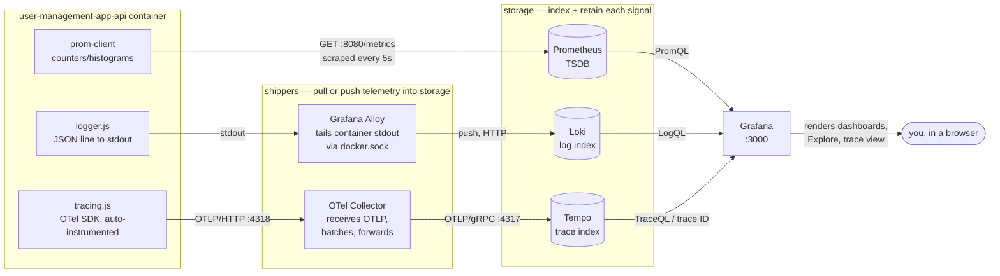

# Local observability: metrics, logs & traces in a real Grafana UI

This is the guided, hands-on walkthrough for seeing all three signals — metrics, logs,
and traces — for `user-management-app-api`, in a real local Grafana, **before** any of
it touches AKS. Everything below was run and verified against this exact
`docker-compose.yml` while writing this doc; the sample output you see is real, not
illustrative.

It exists because "the app emits telemetry" and "you can see the app's telemetry in
Grafana" are different claims — this proves the second one, locally, with your own eyes,
first.

## 1. Architecture — every component, and why it exists

Four stages, always: **emit → ship → store → view**. Metrics collapse "ship" into the
storage step (Prometheus pulls directly); logs and traces each need a dedicated shipper
because the app never talks to Loki/Tempo itself — it only ever writes to stdout or to
the OTel SDK.



### Why each one is needed — what breaks if you remove it

| Component | Job | Remove it and… |
|---|---|---|
| **`prom-client`** (in `server.js`) | Counts requests, times them, exposes the numbers as text on `GET /metrics` | No numbers exist anywhere. Prometheus has nothing to scrape. |
| **`logger.js`** | Writes one JSON line per request to stdout, tagged with the request's `trace_id` | Logs would still exist (Express/Node print *something*), but unstructured and with no `trace_id` — you'd never be able to jump from a log line to its trace. |
| **`tracing.js`** (OTel SDK) | Auto-wraps Express and `pg` calls in spans, exports them | No spans are ever created. There is nothing for the Collector or Tempo to receive — traces don't exist without this, full stop. |
| **Prometheus** | Pulls `/metrics` on a timer, stores the time series, answers PromQL | Without it, the numbers `prom-client` computes just sit in the container and vanish every 5 seconds — nothing persists or queries them. |
| **Grafana Alloy** | The only thing that can reach the log lines — tails every container's stdout via the Docker socket, parses the JSON, pushes to Loki | The app **cannot** push logs to Loki itself (it only knows how to `console.log`). Without a shipper, stdout logs stay trapped inside `docker logs <container>` and never reach any queryable store. |
| **Loki** | Indexes and stores log lines so they're searchable by label/text later | Without it, Alloy has nowhere to push to — logs would only ever be visible one container at a time via `docker compose logs`, not searchable, not correlated with traces. |
| **OpenTelemetry Collector** | Receives OTLP spans from the app, batches them, forwards to Tempo | The OTel SDK exports spans over the network on a timer/batch — it needs *something* listening on 4317/4318. Removing the Collector means every export call fails silently and no span ever reaches storage. (It's also the seam where you'd later fan metrics or logs through OTLP too, without touching app code again.) |
| **Tempo** | Indexes and stores trace spans by trace ID, answers TraceQL | Without it, the Collector has nowhere to forward to — spans would be generated and exported, then dropped with nowhere to land. |
| **Grafana** | The one UI on top of all three stores — PromQL against Prometheus, LogQL against Loki, TraceQL against Tempo, and the log↔trace jump link | Without it, every signal above still technically "works," but you'd be back to `curl`-ing raw APIs by hand (exactly what we did in §4's fallback) instead of a browsable UI. This is the component that turns "data exists somewhere" into "a person can actually look at it." |

The common thread: **the app can produce all three signals on its own, but it can't
store, index, correlate, or display any of them.** Every component past `tracing.js` /
`logger.js` / `prom-client` exists to do one of those four jobs — take one away and that
job just doesn't happen for that signal.

Every one of these runs as a plain container in `docker-compose.yml` locally, and as a
Flux-managed `HelmRelease` in `infrastructure/observability/*.yaml` on AKS — same
components, same config shape, just Docker Compose vs. Kubernetes as the runtime. See
§5.

## 2. Run it

```bash
cd apps/user-management-app
cp .env.example .env          # first time only
docker compose up --build -d
docker compose ps             # everything should be "Up" / "healthy"
```

You now have, on top of the app itself:

| URL | What |
|---|---|
| http://localhost:8081 | the app (log in `admin` / `password123`) |
| http://localhost:8080/metrics | raw Prometheus metrics, direct from the api |
| **http://localhost:3000** | **Grafana — admin / admin** |

Loki (3100), Tempo (3200) and Prometheus (9090) are reachable from other containers on
the compose network but aren't published to the host — Grafana is the only door in,
same as it'll be on AKS.

## 3. Generate some traffic

```bash
curl -s -X POST http://localhost:8080/api/login \
  -H 'Content-Type: application/json' \
  -d '{"username":"admin","password":"password123"}'
# {"token":"eyJhbGciOi..."}

TOKEN=$(curl -s -X POST http://localhost:8080/api/login \
  -H 'Content-Type: application/json' \
  -d '{"username":"admin","password":"password123"}' | node -e \
  "process.stdin.on('data',d=>console.log(JSON.parse(d).token))")

curl -s http://localhost:8080/api/users -H "Authorization: Bearer $TOKEN"

# one deliberately-wrong login, to see a non-200 show up too
curl -s -X POST http://localhost:8080/api/login \
  -H 'Content-Type: application/json' \
  -d '{"username":"admin","password":"wrong"}'
# {"error":"invalid credentials"}
```

Every request is now sitting in Prometheus, Loki, and Tempo. This is exactly what
running the app normally does — no test-only code path.

## 4. Find it in Grafana — step by step

Open **http://localhost:3000**, log in `admin` / `admin`, then go to **Explore**.

> **UI gotcha (Grafana 11, verified against this exact stack):** the left nav's
> **Explore** entry expands into shortcut sub-apps — **Metrics** (a Prometheus-only mini
> app) and **Logs** (a Loki-only mini app). There's no **Traces** shortcut in that list;
> that Explore-Traces app isn't enabled in this Grafana build. Don't use those
> shortcuts. Instead click **Explore** itself (the parent row/compass icon), or go
> straight to `http://localhost:3000/explore` — that's the classic Explore workbench,
> and it has a datasource dropdown at the top that includes **Loki**, **Tempo**, and
> **Prometheus**. Everything below assumes you're in that classic workbench.

### 4a. Logs (Loki)

1. Pick the **Loki** datasource from the dropdown at the top.
2. Query:
   ```logql
   {service="docker", container="user-management-app-api-1"}
   ```
3. You'll see one line per request, e.g. (real output captured while writing this doc):
   ```json
   {"timestamp":"2026-09-12T20:02:20.734Z","level":"info","msg":"request","service":"user-management-app-api","trace_id":"394fa56f834198cc4b7b45e22bbce1c7","span_id":"52835a75dc32926b","method":"POST","route":"/api/login","status":200,"duration_ms":71}
   ```
4. Filter to just the failed login:
   ```logql
   {service="docker", container="user-management-app-api-1"} | json | status = `401`
   ```
5. Expand any line (click the small **`>`** arrow at the left edge — clicking the line
   text itself just selects it). Look for a **`TraceID`** entry (capital, separate from
   the lowercase `trace_id` you already see in the raw JSON text) with a small link icon
   next to it. That's the `derivedFields` entry from
   `observability/grafana-datasources.yaml` — it regex-matches `trace_id` out of the log
   line and opens it directly in Tempo. Click the icon.

   **If that link doesn't appear or doesn't navigate** (a known rendering quirk we hit
   testing this), use the guaranteed fallback in 4b instead — copy the `trace_id` value
   as plain text and paste it straight into Tempo. The backend wiring can be correct
   (verify with `curl -u admin:admin http://localhost:3000/api/datasources` — the Loki
   datasource's `jsonData.derivedFields[0].datasourceUid` should equal the Tempo
   datasource's own `uid`) even when the click-through link itself misbehaves in the
   browser; don't let that block you from seeing traces.

> **Why isn't the 401 line `level=error`?** It isn't a failure of the *system* — a wrong
> password is an expected, handled outcome, so it's logged at `info` like every other
> completed request. `logger.js`'s `log.error(...)` calls are reserved for the `catch`
> blocks around unexpected exceptions (a DB error, etc.) — try stopping the `db`
> container mid-request if you want to see one of those.

### 4b. Traces (Tempo)

The reliable way in (works regardless of the derived-field link quirk in 4a):

1. In the classic Explore workbench, switch the datasource dropdown to **Tempo**.
2. Paste a `trace_id` you copied from a Loki log line straight into the query box
   (it accepts a bare trace ID directly — no special syntax needed), **or** use
   **TraceQL**: `{ name = "POST /api/login" }` lists every login trace.

You land on a trace view — real spans, captured live while testing this doc:

```
POST /api/login                         (root span, ~72ms)
├─ middleware - query
├─ middleware - expressInit
├─ middleware - jsonParser
├─ middleware - <anonymous>
└─ request handler - /api/login
   ├─ pg-pool.connect
   └─ pg.query:SELECT user_management_app
```

> **Pick a `/api/login` or `/api/users` trace, not a `/metrics` or `/api/healthz`
> one**, if you want to see the DB child spans (`pg-pool.connect` / `pg.query`). Traces
> from `/metrics` (Prometheus's own scrape) or `/api/healthz` are real too, but those
> routes never touch Postgres, so their span tree is just the Express middleware chain —
> correct, just less interesting to look at.

That's `express` and `pg` auto-instrumentation (from
`@opentelemetry/auto-instrumentations-node`, wired in `api/src/tracing.js`) — nothing
manually instrumented in `server.js`. Every span in the tree shares one `trace_id`; the
DB call is correctly nested under the request handler, proving parent/child context
propagates across the async `pool.query()` call.

From here, the trace view also has a **"Logs for this span"** link — the reverse
direction, trace → log — built from the `tracesToLogsV2` block in the same
`grafana-datasources.yaml`, which runs a Loki query filtered to that exact `trace_id`.

### 4c. Metrics (Prometheus)

Switch Explore to **Prometheus**:

```promql
sum(rate(http_request_duration_seconds_count[1m])) by (route, status)
```

gives you request-rate-by-route-and-status — real output captured while writing this
doc:

| route | status | value |
|---|---|---|
| `/api/healthz` | 200 | 0.108/s |
| `/metrics` | 200 | 0.092/s |
| `/api/login` | 200 | 0 (idle at capture time) |
| `/api/login` | 401 | 0 (idle at capture time) |

or check the scrape itself is healthy:

```promql
up{job="user-management-app-api"}
```
→ `1` (Prometheus is one raw static scrape config here —
`observability/prometheus-config.yaml` — vs. the `ServiceMonitor` used on AKS; same
metric, different discovery mechanism).

## 5. How this maps onto AKS

| Local (this doc) | AKS (`infrastructure/observability/`) | Same? |
|---|---|---|
| `prometheus` container, static scrape config | kube-prometheus-stack `ServiceMonitor` (already deployed, built earlier in this project) | same Prometheus, different discovery |
| `otel-collector` container, `observability/otel-collector-config.yaml` | `otel-collector.yaml` HelmRelease | same collector image + pipeline shape |
| `tempo` container, `observability/tempo-config.yaml` | `tempo.yaml` HelmRelease | same storage backend (local/filesystem), same retention |
| `loki` container, `observability/loki-config.yaml` | `loki.yaml` HelmRelease | same SingleBinary + filesystem storage shape |
| `alloy` container, Docker-socket log discovery | Alloy **DaemonSet** (node-level log-file tailing) — not yet written | same shipper, different discovery source (containers vs. node log files) |
| `grafana-datasources.yaml` (file provisioning) | `GrafanaDatasource` CRs (operator-managed) — not yet written | same Loki/Tempo config, different provisioning mechanism (file vs. CRD) |

Nothing here changes the app: `OTEL_EXPORTER_OTLP_ENDPOINT` is the one env var that
differs (`http://otel-collector:4318` locally, set directly in `docker-compose.yml`;
`http://otel-collector.monitoring.svc:4318` on AKS, already set in
`k8s/base/api.yaml`).

## 6. Tear down

```bash
docker compose down -v   # stops everything, wipes db/tempo/loki volumes
```
