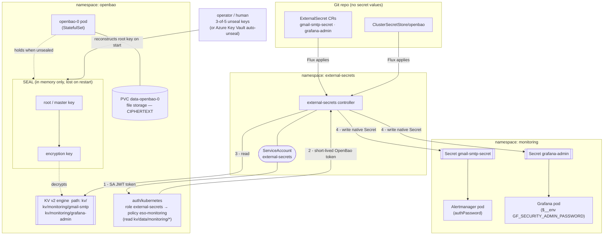

# infrastructure/secrets — secret management (External Secrets Operator + OpenBao)

Secret **values** never live in git. The repo holds only *references* (`ExternalSecret`
CRs). A controller pulls the real values from **OpenBao** and writes native Kubernetes
`Secret`s that the apps consume.

- **External Secrets Operator (ESO)** — Apache-2.0, CNCF. Watches `ClusterSecretStore` /
  `ExternalSecret` CRs and syncs. This repo uses its `vault` provider (OpenBao is
  API-compatible with HashiCorp Vault).
- **OpenBao** — MPL-2.0, Linux Foundation. The open-source fork of HashiCorp Vault, made
  after Vault relicensed to BSL. Same HTTP API, same `bao` CLI (drop-in for `vault`).

---

## What OpenBao brings

| Plain Kubernetes `Secret` | OpenBao |
|---|---|
| base64, **not** encryption | encrypted at rest; the encryption key is itself sealed (see below) |
| readable by anyone with `get secret` in the namespace | fine-grained **policies** per path; identity-based auth (Kubernetes, AppRole, OIDC…) |
| trivially committed to git by mistake | lives only in OpenBao; git holds a *pointer* |
| no history, no rotation story | **versioned** KV, rotation, leases, dynamic secrets (DBs, cloud creds, PKI) |
| no audit | **audit device** logs every read/write |

For this repo OpenBao holds two static KV secrets. The value is the *pattern*: add a
third with one `bao kv put` + one `ExternalSecret` — no new Helm, no new operator.

---

## How it fits together



**The read path (steps 1–4):** ESO's pod presents its ServiceAccount JWT to OpenBao's
`auth/kubernetes` backend → OpenBao validates it with the Kubernetes TokenReview API,
matches the `external-secrets` role, and returns a short-lived OpenBao token scoped by
the `eso-monitoring` policy → ESO reads `kv/monitoring/*` → ESO writes the native
`Secret` in `monitoring`. No static OpenBao token is stored anywhere.

---

## ServiceAccounts

| ServiceAccount | Namespace | Created by | Used for |
|---|---|---|---|
| `openbao` | `openbao` | the OpenBao Helm chart | the identity the `openbao-0` pod runs as. OpenBao's `auth/kubernetes` backend uses **this** SA's token (mounted in the pod) to call the cluster's TokenReview API when validating incoming JWTs. |
| `external-secrets` | `external-secrets` | the ESO Helm chart | the identity ESO authenticates to OpenBao *as*. Named in `stores/clustersecretstore-openbao.yaml` (`auth.kubernetes.serviceAccountRef`) and bound in OpenBao by `bound_service_account_names=external-secrets` + `bound_service_account_namespaces=external-secrets`. |
| `flux-applier` | each app/infra namespace | the AKS Flux extension **or you** (see gotcha below) | the SA Flux's helm-/kustomize-controller impersonates to apply this repo's manifests into that namespace. |

The `ClusterSecretStore` → OpenBao binding, in `stores/clustersecretstore-openbao.yaml`:

```yaml
spec:
  provider:
    vault:
      server: "http://openbao.openbao.svc:8200"
      path: "kv"            # the KV v2 mount
      version: "v2"
      auth:
        kubernetes:
          mountPath: "kubernetes"          # matches `bao auth enable kubernetes`
          role: "external-secrets"         # matches `auth/kubernetes/role/external-secrets`
          serviceAccountRef:
            name: "external-secrets"
            namespace: "external-secrets"
```

---

## Seal / unseal — the concept

OpenBao encrypts everything it stores with an **encryption key**. That key is itself
encrypted by the **root key** (a.k.a. master key). On disk (`PVC data-openbao-0`)
everything is ciphertext.

When the pod starts it is **sealed**: it has the ciphertext but not the root key in
memory → every API call returns `503`. **Unsealing** rebuilds the root key in memory:

```
unseal key shares ──(Shamir's Secret Sharing: any 3 of 5)──► root/master key
                                                                  │ decrypts
                                                             encryption key
                                                                  │ decrypts
                                                             your secrets (kv/…)
```

- `bao operator init -key-shares=5 -key-threshold=3` (once) generates the root key and
  splits it into **5 shares**, any **3** of which reconstruct it. Shares + the initial
  root token are printed **once**. Lose 3 shares → data is unrecoverable. Store the
  shares separately.
- `bao operator unseal <share>` × 3 → unsealed, serving.
- **Every pod restart re-seals** (node reboot, `az aks stop`/`start`, `kubectl delete
  pod`). You re-run the 3 unseals. Data on the PVC is intact — only the in-memory root
  key was lost.

This repo uses **Shamir / manual unseal** because it needs nothing extra to provision.

---

## Auto-unseal (production) — master key held by a KMS

Manual unseal doesn't scale (a human + 3 shares on every restart). **Auto-unseal**
delegates protection of the root key to an external KMS — here **Azure Key Vault**.

- At `bao operator init`, OpenBao generates the root key and immediately asks Key Vault
  to **wrap** (encrypt) it; only the wrapped blob is written to the PVC. The plaintext
  root key is never persisted.
- On **every startup** OpenBao sends the wrapped blob to Key Vault, which **unwraps** it
  with a key that never leaves the vault/HSM; OpenBao gets the root key back in memory →
  **auto-unsealed**, no shares, no humans.
- Shamir shares are replaced by **recovery keys** (still 3-of-5) — used only for
  break-glass (regenerate the root token, rekey), never for routine startup.
- Trust moves to Key Vault: access is an Azure RBAC + managed/workload identity
  decision, and the key can be FIPS-140 HSM-backed.

### Enable it

1. **Azure side**

   ```bash
   az keyvault create -g san-rg -n openbao-unseal-kv -l eastus2
   az keyvault key create --vault-name openbao-unseal-kv -n openbao-unseal --protection software   # or hsm
   # identity OpenBao will use — AKS workload identity is cleanest:
   az identity create -g san-rg -n openbao-unseal-id
   CLIENT_ID=$(az identity show -g san-rg -n openbao-unseal-id --query clientId -o tsv)
   az keyvault role assignment create --vault-name openbao-unseal-kv \
     --role "Key Vault Crypto User" --assignee $CLIENT_ID --scope /keys/openbao-unseal
   # federate the identity to the openbao ServiceAccount:
   az identity federated-credential create -g san-rg -n openbao-fed --identity-name openbao-unseal-id \
     --issuer "$(az aks show -g san-rg -n san-dev-aks --query oidcIssuerProfile.issuerUrl -o tsv)" \
     --subject system:serviceaccount:openbao:openbao --audience api://AzureADTokenExchange
   ```
   (needs the cluster created with `--enable-oidc-issuer --enable-workload-identity`.)

2. **`infrastructure/secrets/openbao/openbao.yaml`** — replace the `standalone.config`
   HCL and label the SA for workload identity:

   ```yaml
   spec:
     values:
       server:
         serviceAccount:
           annotations:
             azure.workload.identity/client-id: "<CLIENT_ID>"
         extraLabels:
           azure.workload.identity/use: "true"
         standalone:
           enabled: true
           config: |
             ui = true
             listener "tcp" { address = "[::]:8200"  tls_disable = 1 }
             storage "file" { path = "/openbao/data" }
             seal "azurekeyvault" {
               vault_name = "openbao-unseal-kv"
               key_name   = "openbao-unseal"
               # tenant_id / client via workload identity — no secret in config
             }
   ```

3. `bao operator init` now prints **recovery** keys; the pod comes up unsealed on its
   own, including after `az aks start`. Everything else (KV, k8s auth, policy, role) is
   the same one-time setup.

---

## Bootstrap OpenBao (one time — first install, or after any Tier ≥ 2 rebuild)

Exactly what was run for this deployment:

```bash
# init (SAVE the 5 unseal keys + root token that this prints)
kubectl -n openbao exec openbao-0 -- sh -c \
  'BAO_ADDR=http://127.0.0.1:8200 bao operator init -key-shares=5 -key-threshold=3 -format=json'

# unseal — 3 different keys
for K in <KEY_1> <KEY_2> <KEY_3>; do
  kubectl -n openbao exec openbao-0 -- sh -c "BAO_ADDR=http://127.0.0.1:8200 bao operator unseal '$K'"
done

# configure (root token from init)
kubectl -n openbao exec openbao-0 -- sh -c '
  export BAO_ADDR=http://127.0.0.1:8200 BAO_TOKEN=<ROOT_TOKEN>
  bao secrets enable -path=kv kv-v2
  bao auth enable kubernetes
  bao write auth/kubernetes/config kubernetes_host=https://kubernetes.default.svc
  printf "path \"kv/data/monitoring/*\" { capabilities = [\"read\"] }\npath \"kv/data/user-management-app/*\" { capabilities = [\"read\"] }\npath \"kv/data/flux/*\" { capabilities = [\"read\"] }\n" | bao policy write eso-monitoring -
  bao write auth/kubernetes/role/external-secrets \
      bound_service_account_names=external-secrets \
      bound_service_account_namespaces=external-secrets \
      policies=eso-monitoring ttl=1h
  # seed the values
  bao kv put kv/monitoring/gmail-smtp    password="YOUR_GMAIL_APP_PASSWORD"
  bao kv put kv/monitoring/grafana-admin password="A_STRONG_ADMIN_PASSWORD"
  bao kv put kv/user-management-app/jwt  secret="$(openssl rand -hex 32)"          # API JWT signing key
  bao kv put kv/flux/git-credentials     username="<github-username>" password="<GITHUB_PAT>"  # Flux image automation git write-back
  bao kv put kv/flux/acr-pull            username="flux-pull-token"   password="<ACR_TOKEN>"   # image-reflector-controller ACR reads
'
```

> `kv/flux/*` is only needed if you deploy `infrastructure/flux-image-automation/` — see
> its own README for how to generate the PAT and ACR token.

Within a minute ESO creates `gmail-smtp-secret`, `grafana-admin` and (per user-management-app
namespace) `user-management-app-jwt`, and `secrets` → `grafana` / `alert` / `user-management-app-*` go
`READY`. The `external-secrets` role's `bound_service_account_namespaces` stays
`external-secrets` — ESO uses one ServiceAccount regardless of which namespace the
target Secret lands in.

> **Persistence.** OpenBao data is on PVC `data-openbao-0` — survives pod restarts and
> `az aks stop`/`start`. After a restart you only re-run the **3 unseals** (or nothing,
> with auto-unseal). A full teardown (repo/cluster/RG deleted) loses the PVC → redo the
> whole block above with fresh keys.

---

## Add a new secret — worked examples

### Example 1 — a single-field secret (like the two we have)

Say Grafana needs an OAuth client secret.

```bash
# 1. put it in OpenBao
kubectl -n openbao exec openbao-0 -- sh -c \
  'BAO_ADDR=http://127.0.0.1:8200 BAO_TOKEN=<ROOT_TOKEN> \
   bao kv put kv/monitoring/grafana-oauth client_secret="s3cr3t"'
```

```yaml
# 2. infrastructure/secrets/externalsecrets/grafana-oauth.yaml
apiVersion: external-secrets.io/v1
kind: ExternalSecret
metadata:
  name: grafana-oauth
  namespace: monitoring
spec:
  refreshInterval: 1h
  secretStoreRef:
    kind: ClusterSecretStore
    name: openbao
  target:
    name: grafana-oauth            # the K8s Secret name the app expects
    creationPolicy: Owner
  data:
    - secretKey: client_secret     # key inside the K8s Secret
      remoteRef:
        key: monitoring/grafana-oauth   # OpenBao path under kv/  (→ kv/data/monitoring/grafana-oauth)
        property: client_secret          # field within that OpenBao secret
```

```yaml
# 3. infrastructure/secrets/kustomization.yaml → add
resources:
  - stores/clustersecretstore-openbao.yaml
  - externalsecrets/gmail-smtp.yaml
  - externalsecrets/grafana-admin.yaml
  - externalsecrets/grafana-oauth.yaml   # <-- new
```

```bash
# 4. ship it
git add infrastructure/secrets/ && git commit -m "add grafana-oauth secret" && git push
flux reconcile kustomization platform-config-secrets -n flux-system
kubectl get externalsecret grafana-oauth -n monitoring    # → SecretSynced=True
```

### Example 2 — many fields → one Secret, in one shot

```bash
kubectl -n openbao exec openbao-0 -- sh -c \
  'BAO_ADDR=http://127.0.0.1:8200 BAO_TOKEN=<ROOT_TOKEN> \
   bao kv put kv/monitoring/smtp host="smtp.gmail.com:587" user="me@gmail.com" password="app-pw"'
```

```yaml
spec:
  target:
    name: smtp-credentials
  dataFrom:
    - extract:
        key: monitoring/smtp        # pulls ALL fields → Secret keys host/user/password
```

### Example 3 — render a config file from secret fields (templating)

```yaml
spec:
  target:
    name: alertmanager-smtp-conf
    template:
      engineVersion: v2
      data:
        smtp.yaml: |
          host: "{{ .host }}"
          user: "{{ .user }}"
          password: "{{ .password }}"
  data:
    - {secretKey: host,     remoteRef: {key: monitoring/smtp, property: host}}
    - {secretKey: user,     remoteRef: {key: monitoring/smtp, property: user}}
    - {secretKey: password, remoteRef: {key: monitoring/smtp, property: password}}
```

### Rotating a value

```bash
kubectl -n openbao exec openbao-0 -- sh -c \
  'BAO_ADDR=http://127.0.0.1:8200 BAO_TOKEN=<ROOT_TOKEN> \
   bao kv put kv/monitoring/grafana-admin password="NEW_PASSWORD"'
# ESO re-syncs within refreshInterval (1h); force now:
kubectl annotate externalsecret grafana-admin -n monitoring force-sync=$(date +%s) --overwrite
# then bounce the consumer so it re-reads the env/file:
kubectl rollout restart deploy/grafana-deployment -n monitoring
```

---

## Verify

```bash
kubectl get pods -n external-secrets           # external-secrets, -webhook, -cert-controller  (1/1)
kubectl get pods -n openbao                     # openbao-0  (1/1 once unsealed)
kubectl -n openbao exec openbao-0 -- sh -c 'BAO_ADDR=http://127.0.0.1:8200 bao status' | grep Sealed   # → false
kubectl get clustersecretstore openbao          # STATUS Valid, READY True
kubectl get externalsecret -n monitoring        # both → STATUS SecretSynced, READY True
kubectl get secret -n monitoring gmail-smtp-secret grafana-admin
kubectl describe externalsecret grafana-admin -n monitoring   # events / errors
```

---

## Gotchas hit while deploying this (fixed in-repo where possible)

| Symptom | Cause | Fix |
|---|---|---|
| `openbao-0` `ImagePullBackOff` → `quay.io/quay.io/openbao/openbao` | a bare `server.image.repository:` override gets the chart's `image.registry` prepended | removed the override — chart default is correct (`openbao.yaml`) |
| `secrets` Kustomization: `no matches for kind "ExternalSecret" in version "external-secrets.io/v1beta1"` | ESO ≥ 0.14 serves only `external-secrets.io/v1` | CRs are `apiVersion: external-secrets.io/v1` |
| HelmReleases in `monitoring`/`openbao`/`external-secrets`: `serviceaccount "flux-applier" ... cannot list secrets` | AKS Flux extension provisioned `flux-applier` only in `flux-system` (no `targetNamespace` in the config) | create `flux-applier` SA + a `cluster-admin` ClusterRoleBinding in each target namespace (see root README §3.6), or pass `targetNamespace=<ns>` on each `--kustomization` |
| `GrafanaDashboard`: `folder not found` (once, then clears) | dashboard pushed before the `GrafanaFolder` registered | transient — the operator retries; `kubectl rollout restart deploy/grafana-operator -n monitoring` to force |
